# Allocura Matching: Current Status and End-to-End Example

[German version](README_DE.md) · [Detailed technical documentation](README_DETAILED.md)

The simplest description is:

> We have built and tested the matching engine and the real two-file ERP import. SharePoint file
> metadata and normalized offers have versioned API boundaries, but the live Graph synchronizer,
> source extraction, and final production embedding-model choice remain deployment/workstream tasks.

It currently works when it receives already-clean, structured data.

```mermaid
flowchart LR
    S["Inquiry Excel/SharePoint<br/>(external extraction)"] --> A["Normalized inquiry line"]
    A --> B["Validate input"]
    B --> C["Search for candidates<br/>in four ways"]
    C --> D["Merge candidate lists"]
    D --> E["Check safety and attributes"]
    E --> F["Calculate packaging<br/>and inspect stock"]
    F --> G["Create deterministic ranking"]
    G --> H["Return up to 10<br/>explained candidates"]
    H --> I["Human confirms or changes"]
    I --> J["Decision is stored<br/>for later evaluation"]
```



## A concrete example

**Example source:** [`tests/matching/factories.py`](../../tests/matching/factories.py) defines the
inquiry and catalogue records; [`tests/matching/test_service.py`](../../tests/matching/test_service.py)
runs the complete example. [`service.py`](service.py) coordinates the end-to-end matching sequence.

The automated tests contain this example inquiry:

| Input field | Value |
|---|---|
| Description | `SONDE VESICALE FOLEY sterile CH18` |
| Product type | Medical equipment |
| Quantity | 50 pieces |
| Size | CH18 |
| Sterile | Yes |
| Customer | `partner-1` |
| Destination | Democratic Republic of the Congo |
| Source | Row 7 of `request.xlsx` |

The important point is that the matching code does not read row 7 itself. Another component must
first turn the Excel row—or an Outlook email—into this structured information.

From the matching system's perspective, Excel and Outlook become the same kind of input after
extraction.

## Step 1: Validate the input

**Responsible code:** [`contracts.py`](contracts.py) defines the permitted input structure and
[`validation.py`](validation.py) performs the additional matching-specific checks.

The framework checks whether the input has the expected structure:

- Is there an inquiry and line ID?
- Is this a medicine or equipment request?
- Is there a description?
- Is the quantity valid?
- Are source file, row and timestamp recorded?
- If an embedding is supplied, does it also include a model ID?

For the example, validation returns:

```text
Status: valid
Warnings: none
Errors: none
```

Missing information does not always stop matching. For example, a missing quantity can produce a
warning while textual product search still continues.

## Step 2: Create a searchable representation

**Responsible code:** [`representation.py`](representation.py) normalizes the text, renders the
structured attributes and creates the stable content hash.

The description and attributes are converted into a stable internal text:

```text
sonde vesicale foley sterile ch18;
charriere=18 ch;
sterile=true
```

This makes searches reproducible and ensures that important structured values such as CH18 are not
hidden inside the description.

What it does not currently do is translate this text automatically. Multilingual understanding will
ultimately come from a selected multilingual embedding model or an upstream translation. The
production model has not been selected yet.

## Step 3: Search for possible products

**Responsible code:** [`retrieval/exact.py`](retrieval/exact.py),
[`retrieval/lexical.py`](retrieval/lexical.py), [`retrieval/vector.py`](retrieval/vector.py) and
[`retrieval/history.py`](retrieval/history.py) implement the four search channels. The real
PostgreSQL/pgvector queries live in [`adapters/persistence.py`](adapters/persistence.py).

The test catalogue contains three products:

| Product | Description | Status | Stock |
|---|---|---|---:|
| `410001001` | Foley catheter, sterile, CH18 | Active | 80 pieces |
| `410001002` | Foley catheter, sterile, CH12 | Active | 500 pieces |
| `410001003` | Foley catheter, sterile, CH18 | Inactive | 500 pieces |

The framework searches through four independent channels.

### 1. Exact search

This checks for an explicitly supplied article number or an identical normalized description.

No article number was supplied in this example.

### 2. Lexical search

This compares the actual words and characters. It recognizes that “Sonde Vesicale Foley” resembles
“Foley urinary catheter,” although this method alone is not genuinely language-independent.

### 3. Vector search

This compares the inquiry embedding with stored product embeddings.

In the test, the vectors are artificial and deterministic. They prove that the integration works,
but they are not a selected production multilingual model.

### 4. Historical search

This looks at previous requests and offers. In the example, the customer previously received an offer
involving product `410001003`.

History may therefore bring that product into consideration—but history can never override current
safety or catalogue status.

## Step 4: Merge the search results

**Responsible code:** [`retrieval/fusion.py`](retrieval/fusion.py) implements Reciprocal Rank Fusion
and deduplicates products found by several search channels.

Each search method produces its own ranked list.

The framework does not directly add the raw scores because a lexical score and a vector score mean
different things. Instead, Reciprocal Rank Fusion rewards products that appear near the top of several
lists.

In this example, inactive product `410001003` may initially look especially promising:

- its text is a good match;
- its vector is a good match;
- it appears in customer history.

But search only finds possibilities. It does not approve them.

## Step 5: Apply safety and attribute checks

**Responsible code:** [`constraints/engine.py`](constraints/engine.py) evaluates the rules, while
[`config/default_policy_v1.json`](config/default_policy_v1.json) defines the current behavior for
missing or mismatching attributes.

Every retrieved product is checked independently.

### Product `410001001`

- correct domain: pass
- requested CH18, product CH18: pass
- requested sterile, product sterile: pass
- active: yes
- quality-blocked: no

Result: `pass`

### Product `410001002`

- correct domain: pass
- requested CH18, product CH12: mismatch
- requested sterile, product sterile: pass
- active: yes

Result: `review`

It is not automatically excluded because action medeor has not yet formally approved which size or
substitution mismatches must be hard exclusions. The system therefore exposes the problem instead of
inventing a medical rule.

### Product `410001003`

- correct domain: pass
- CH18: pass
- sterile: pass
- active: no

Result: `exclude`

This product is removed even though search and customer history liked it. That is an important safety
property: retrieval strength cannot outweigh an authoritative exclusion.

## Step 6: Calculate packaging

**Responsible code:** [`packaging.py`](packaging.py), specifically `calculate_packaging`, calculates
the lower and upper package alternatives without inventing a rounding decision.

All three products contain 12 pieces per package. The inquiry requests 50 pieces.

The framework calculates both possibilities:

```text
4 packages = 48 pieces → 2 pieces too few
5 packages = 60 pieces → 10 pieces too many
```

It does not automatically choose one because action medeor has not confirmed whether the system
should round up, round down or ask the user.

Therefore, the output contains both options and a warning:

```text
Rounding policy is not confirmed; no option was auto-selected.
```

## Step 7: Inspect availability

**Responsible code:** [`packaging.py`](packaging.py), specifically `observed_availability`, compares
the requested amount with confirmed and unit-compatible on-hand stock.

For product `410001001`:

```text
Required: 50 pieces
On hand: 80 pieces
Result: sufficient
```

For product `410001002`:

```text
Required: 50 pieces
On hand: 500 pieces
Result: sufficient
```

The CH12 product does not win merely because it has more stock. Product suitability and review status
come before availability.

For imported ERP data, availability is now calculated as:

```text
raw availability = Lagerbestand + Menge in Bestellung - Menge in Auftrag
fulfillable quantity = max(0, raw availability)
```

The raw result remains visible when negative; only the quantity that can be promised is clamped to
zero. `Menge in Anfrage`/purchasing inquiries are stored when available but are not counted as
confirmed incoming stock. The wire status names still say `on_hand_*` for V1 compatibility, but the
number behind them is the calculated fulfillable quantity.

## Step 8: Rank the remaining products

**Responsible code:** [`ranking/features.py`](ranking/features.py) creates the inspectable ranking
components and [`ranking/ranker.py`](ranking/ranker.py) applies the deterministic ordering.

The current ordering is:

1. fully passing products before products requiring review;
2. exact article-number matches;
3. stronger structured-attribute agreement;
4. combined search rank;
5. comparable availability;
6. article number as a stable final tie-breaker.

Therefore, the result is:

| Rank | Product | Outcome | Why |
|---:|---|---|---|
| 1 | `410001001` | Pass | CH18, sterile, active and enough stock |
| 2 | `410001002` | Review | CH12 differs from requested CH18 |
| — | `410001003` | Excluded | Article is inactive |

The output contains two products, not ten. “Top 10” means up to ten; the framework never fills missing
positions with unsuitable products.

## Step 9: Return an explained result

**Responsible code:** [`service.py`](service.py) assembles the final candidates,
[`contracts.py`](contracts.py) defines the response format and [`api.py`](api.py) exposes it through
HTTP.

For every returned product, the API includes:

- article number and rank;
- why each search method found it;
- rule results and mismatching values;
- packaging alternatives;
- availability status;
- warnings;
- source information;
- algorithm, rule and embedding-model versions.

It deliberately does not return a statement such as “93% correct.” The current search scores have not
been calibrated as correctness probabilities.

## Step 10: Store the human decision

**Responsible code:** [`feedback.py`](feedback.py) validates the decision against the displayed
candidates, [`adapters/persistence.py`](adapters/persistence.py) stores it and [`api.py`](api.py)
provides the decision endpoint.

The employee can subsequently record:

- accept the suggested product;
- choose another displayed candidate;
- create a manual match;
- state that there is no match;
- state that procurement is required.

The system verifies that an accepted suggestion was actually shown in that matching run.

The decision is stored, but it does not immediately modify the algorithm. That avoids unsafe learning
from accidental clicks. The decisions form a clean dataset for later offline evaluation and
controlled learning.

## What is genuinely implemented now?

| Area | Current status |
|---|---|
| Input contracts and validation | Implemented |
| Exact and lexical search | Implemented |
| Vector storage and search with pgvector | Implemented |
| Historical search | Implemented |
| Candidate-list fusion | Implemented |
| Conservative rules | Implemented |
| Packaging calculation | Implemented |
| Basic stock comparison | Implemented |
| Deterministic ranking | Implemented |
| API and decision storage | Implemented |
| Database schema and migrations | Implemented |
| Two-file ERP catalog/import API | Implemented and validated against the supplied CSVs |
| Immutable text/inventory versions | Implemented |
| Missing-item flag from first absence | Implemented |
| Incremental embedding job queue/worker | Implemented; waits for an approved model |
| SharePoint file-link and normalized-offer APIs | Implemented; extraction is external |
| Free-first cloud embedding benchmark | Implemented |
| Automated tests | Implemented |

## What is not yet operational?

| Area | Current reality |
|---|---|
| Excel/Outlook extraction | Must be built by the extraction workstream |
| First production catalog load | Run the import against the deployed PostgreSQL database after migration |
| Production embeddings | Worker exists; benchmark winner and immutable revision are not selected |
| Automatic query embeddings | Works in a model-enabled runtime when the approved model is configured; leave disabled until selection |
| ERP scheduling | CSV upload endpoint exists; the Azure schedule/upload job is deployment work |
| SharePoint synchronization | File API exists; read-only Microsoft Graph scheduled job still needs deployment credentials/site IDs |
| SharePoint extraction | Explicitly owned by the separate extraction workstream |
| Supplier availability | Not connected |
| Price, shelf-life and reliability ranking | Not active because comparable data and rules are missing |
| Active learning | Decisions are stored, but the ranking does not learn from them yet |
| Figma UI integration | Transport contracts and real adapter prepared; visible app still uses fixtures |

So Matching V1 now has its database and ingestion boundaries, not just an isolated algorithm. The
remaining operational work is to deploy PostgreSQL, run the first import, connect the scheduled
read-only jobs, execute the cloud benchmark, approve one pinned model, and connect the UI/extraction
workstreams.

## How to operate the new data path: a compact example

Matching does not read ERP CSVs directly. The catalogue boundary prepares database versions first;
matching then reads only validated current records.

1. Start PostgreSQL/pgvector and run `alembic upgrade head`.
2. Keep `Artikeldaten.csv` and `Artikeluebersetzungen.csv` from the same Business Central export
   together. Both must be UTF-8, semicolon-separated files.
3. Upload both files in one request:

   ```bash
   curl --fail-with-body -X POST http://localhost:8000/api/v1/catalog-imports \
     -F article_data=@/secure-input/Artikeldaten.csv \
     -F article_translations=@/secure-input/Artikeluebersetzungen.csv
   ```

4. Save `import_id` and `catalog_snapshot_id`, then check all returned counts. The supplied first pair
   contains 2,773 articles, 2,879 translation rows and 1,645 matching-eligible variants. With no
   active model, `embedding_jobs_created` is expected to be zero. Use the returned
   `catalog_snapshot_id` when a later match run must be pinned to this exact source version.
5. Read a known article through `GET /api/v1/catalog-items/{item_number}` and repeat the identical
   upload once; the second response must say `idempotent_replay: true`.
6. For later pairs, inspect new, text-updated, metadata-updated, missing, reactivated and embedding-job
   counts before accepting the import operationally.

**Responsible code:**

- [`../catalog/parser.py`](../catalog/parser.py) validates both CSV schemas, joins translations by
  article number, determines eligibility and creates canonical text/hashes;
- [`../catalog/service.py`](../catalog/service.py) performs the atomic initial/incremental update,
  inventory snapshots, first-absence flagging, reactivation and job creation;
- [`../catalog/api.py`](../catalog/api.py) defines the upload/status/item routes;
- [`../../migrations/versions/20260819_0002_catalog_offer_sync.py`](../../migrations/versions/20260819_0002_catalog_offer_sync.py)
  defines the additional tables and versioning fields;
- [`../../migrations/versions/20260821_0003_review_consistency.py`](../../migrations/versions/20260821_0003_review_consistency.py)
  adds deterministic import/version sequences, snapshot-consistent retrieval and the widened
  SharePoint version field.

The article number remains identity. The text hash only identifies the exact normalized text already
embedded. A changed description creates a new current version and preserves the old one for audit;
an article is missing only when its number disappears from a complete accepted report.

Idempotency applies only to a repeat of the currently applied file pair. An A → B → A sequence
creates three audited imports and restores A on the final import. Database-generated sequences—not
UUID values or possibly equal source timestamps—decide which catalogue and inventory rows are
latest. A supplied `catalog_snapshot_id` pins catalogue text, inventory and vectors together.

## Embeddings still have to be tested and approved

Vector storage and retrieval are implemented, but no model is proven or approved yet. The required
sequence is:

1. Run a small Azure smoke test using both real ERP files and 25 queries.
2. Run MiniLM, BGE-M3 and multilingual E5-large-instruct on the full automatically labelled French
   translation set.
3. Add normalized, human-reviewed partner inquiries whose correct article number is known.
4. Compare Recall@1/3/10, MRR, runtime, vector storage and measured Azure cost.
5. Review errors involving medicine/equipment domain, strength, dosage form, size, sterility and
   packaging. Highest average score alone is not enough.
6. Record the approval and pin one immutable model revision; never use `main` in production.
7. Run [`../catalog/embedding_worker.py`](../catalog/embedding_worker.py) in staging, investigate every
   failed job and verify known match cases.
8. Connect query inference using the exact same model/revision. The standard web image excludes
   PyTorch, so vectors must come from a model-enabled runtime/service or be supplied with
   `embedding_model_id` in the match request.

The executable commands, label format, report interpretation and acceptance record are in
[`../../../../benchmarks/embeddings/README.md`](../../../../benchmarks/embeddings/README.md). Benchmark
logic lives in [`../../../../benchmarks/embeddings/run.py`](../../../../benchmarks/embeddings/run.py);
production model formatting and durable jobs live in
[`../catalog/embeddings.py`](../catalog/embeddings.py).

Until these steps pass, Matching V1 correctly falls back to exact, lexical and historical retrieval,
but it must not be described as semantically validated.

## Matching V1 roadmap

| Order | Next milestone | Proof required before moving on |
|---:|---|---|
| 1 | Merge and deploy the database migration to protected staging | CI green; `/api/health` reports a healthy migrated PostgreSQL/pgvector database |
| 2 | Perform the first two-file ERP import | Plausible counts, representative item checks and idempotent replay confirmed |
| 3 | Rehearse a later ERP update | Quantity-only, text-change, new, missing and reactivated cases behave as documented |
| 4 | Run and approve the embedding benchmark | Full automatic and reviewed-inquiry reports, safety failure review, cost and immutable model revision recorded |
| 5 | Index catalogue and connect query inference | All eligible current versions have compatible vectors and real match runs show vector evidence |
| 6 | Deploy read-only SharePoint Graph synchronization | Stable IDs, versions and live URLs populate the extraction queue; deletion/archive behavior tested |
| 7 | Connect the external extraction output | Validated `InquiryLineV1` and normalized offers use the documented contracts and provenance |
| 8 | Activate the real frontend adapter | Fixture path replaced; explanations, overrides and decisions work end to end |
| 9 | Production hardening | Entra authorization, secrets, monitoring, alerts, backups, rollback and operating ownership accepted |

The detailed rationale and test expectations for every phase are in
[`README_DETAILED.md`](README_DETAILED.md). The repository-level commands and Azure rollout are in
[`../../../../README.md`](../../../../README.md).
