# Allocura Matching: Aktueller Stand und vollständiges Beispiel

[Englische Version](README.md) · [Ausführliche technische Dokumentation](README_DETAILED_DE.md)

Die einfachste Beschreibung lautet:

> Die Matching-Engine und der echte Zwei-Dateien-ERP-Import sind entwickelt und getestet.
> SharePoint-Dateimetadaten und normalisierte Angebote besitzen versionierte API-Grenzen; der
> Live-Graph-Abgleich, die Quellextraktion und die endgültige Wahl des produktiven
> Embedding-Modells bleiben Aufgaben für Deployment beziehungsweise andere Arbeitsbereiche.

Derzeit funktioniert sie, wenn sie bereits bereinigte und strukturierte Daten erhält.

```mermaid
flowchart LR
    S["Anfrage-Excel/SharePoint<br/>(externe Extraktion)"] --> A["Normalisierte Anfrageposition"]
    A --> B["Eingabe validieren"]
    B --> C["Kandidaten auf<br/>vier Wegen suchen"]
    C --> D["Kandidatenlisten zusammenführen"]
    D --> E["Sicherheit und Attribute prüfen"]
    E --> F["Verpackung berechnen<br/>und Bestand prüfen"]
    F --> G["Deterministische Rangfolge erstellen"]
    G --> H["Bis zu 10 erklärte<br/>Kandidaten zurückgeben"]
    H --> I["Mensch bestätigt oder ändert"]
    I --> J["Entscheidung für spätere<br/>Auswertung speichern"]
```



## Ein konkretes Beispiel

**Quelldateien des Beispiels:** [`tests/matching/factories.py`](../../tests/matching/factories.py)
definiert die Anfrage- und Katalogdaten;
[`tests/matching/test_service.py`](../../tests/matching/test_service.py) führt das vollständige
Beispiel aus. [`service.py`](service.py) steuert den gesamten Matching-Ablauf.

Die automatisierten Tests enthalten folgende Anfrage:

| Eingabefeld | Wert |
|---|---|
| Beschreibung | `SONDE VESICALE FOLEY sterile CH18` |
| Produktart | Medizinische Ausrüstung |
| Menge | 50 Stück |
| Größe | CH18 |
| Steril | Ja |
| Kunde | `partner-1` |
| Zielland | Demokratische Republik Kongo |
| Quelle | Zeile 7 aus `request.xlsx` |

Wichtig ist: Der Matching-Code liest Zeile 7 nicht selbst. Eine andere Komponente muss die Excel-Zeile
oder eine Outlook-E-Mail zuerst in diese strukturierten Informationen umwandeln.

Aus Sicht des Matchings werden Excel und Outlook nach der Extraktion zur gleichen Art von Eingabe.

## Schritt 1: Eingabe validieren

**Zuständiger Code:** [`contracts.py`](contracts.py) definiert die erlaubte Eingabestruktur und
[`validation.py`](validation.py) führt die zusätzlichen matching-spezifischen Prüfungen aus.

Das Framework prüft, ob die Eingabe die erwartete Struktur besitzt:

- Gibt es eine Anfrage- und Positions-ID?
- Handelt es sich um eine Medikamenten- oder Ausrüstungsanfrage?
- Ist eine Beschreibung vorhanden?
- Ist die Menge gültig?
- Sind Quelldatei, Zeile und Zeitstempel dokumentiert?
- Wenn ein Embedding übergeben wird: Ist auch eine Modell-ID vorhanden?

Für das Beispiel liefert die Validierung:

```text
Status: valid
Warnungen: keine
Fehler: keine
```

Fehlende Informationen stoppen das Matching nicht immer. Eine fehlende Menge kann beispielsweise eine
Warnung erzeugen, während die textbasierte Produktsuche trotzdem fortgesetzt wird.

## Schritt 2: Eine durchsuchbare Repräsentation erzeugen

**Zuständiger Code:** [`representation.py`](representation.py) normalisiert den Text, bildet die
strukturierten Attribute ab und erzeugt den stabilen Inhalts-Hash.

Die Beschreibung und Attribute werden in einen stabilen internen Text umgewandelt:

```text
sonde vesicale foley sterile ch18;
charriere=18 ch;
sterile=true
```

Dadurch bleibt die Suche reproduzierbar, und wichtige strukturierte Werte wie CH18 verschwinden nicht
innerhalb der Beschreibung.

Was derzeit noch nicht geschieht, ist eine automatische Übersetzung dieses Textes. Das mehrsprachige
Verständnis soll später aus einem ausgewählten mehrsprachigen Embedding-Modell oder einer vorgelagerten
Übersetzung kommen. Das produktive Modell wurde noch nicht ausgewählt.

## Schritt 3: Nach möglichen Produkten suchen

**Zuständiger Code:** [`retrieval/exact.py`](retrieval/exact.py),
[`retrieval/lexical.py`](retrieval/lexical.py), [`retrieval/vector.py`](retrieval/vector.py) und
[`retrieval/history.py`](retrieval/history.py) implementieren die vier Suchkanäle. Die echten
PostgreSQL-/pgvector-Abfragen befinden sich in
[`adapters/persistence.py`](adapters/persistence.py).

Der Testkatalog enthält drei Produkte:

| Produkt | Beschreibung | Status | Bestand |
|---|---|---|---:|
| `410001001` | Foley-Katheter, steril, CH18 | Aktiv | 80 Stück |
| `410001002` | Foley-Katheter, steril, CH12 | Aktiv | 500 Stück |
| `410001003` | Foley-Katheter, steril, CH18 | Inaktiv | 500 Stück |

Das Framework sucht über vier voneinander unabhängige Kanäle.

### 1. Exakte Suche

Sie prüft, ob ausdrücklich eine Artikelnummer angegeben wurde oder eine identische normalisierte
Beschreibung vorhanden ist.

In diesem Beispiel wurde keine Artikelnummer angegeben.

### 2. Lexikalische Suche

Sie vergleicht die tatsächlichen Wörter und Zeichen. Dadurch erkennt sie eine Ähnlichkeit zwischen
„Sonde Vesicale Foley“ und „Foley urinary catheter“. Dieses Verfahren allein ist allerdings nicht
wirklich sprachunabhängig.

### 3. Vektorsuche

Sie vergleicht das Embedding der Anfrage mit den gespeicherten Produkt-Embeddings.

Im Test sind die Vektoren künstlich und deterministisch. Sie beweisen, dass die Integration
funktioniert, sind aber kein ausgewähltes produktives mehrsprachiges Modell.

### 4. Historische Suche

Sie betrachtet frühere Anfragen und Angebote. Im Beispiel hat der Kunde früher ein Angebot erhalten,
in dem Produkt `410001003` vorkam.

Die Historie kann dieses Produkt deshalb in die Kandidatenauswahl aufnehmen. Sie darf aber niemals den
aktuellen Sicherheits- oder Katalogstatus überstimmen.

## Schritt 4: Suchergebnisse zusammenführen

**Zuständiger Code:** [`retrieval/fusion.py`](retrieval/fusion.py) implementiert Reciprocal Rank
Fusion und dedupliziert Produkte, die von mehreren Suchkanälen gefunden wurden.

Jedes Suchverfahren erzeugt seine eigene Rangliste.

Das Framework addiert die Rohscores nicht direkt, weil ein lexikalischer Score und ein Vektorscore
unterschiedliche Bedeutungen haben. Stattdessen belohnt Reciprocal Rank Fusion Produkte, die in
mehreren Listen weit oben erscheinen.

Im Beispiel kann das inaktive Produkt `410001003` zunächst besonders vielversprechend wirken:

- Sein Text passt gut.
- Sein Vektor passt gut.
- Es kommt in der Kundenhistorie vor.

Die Suche findet jedoch nur Möglichkeiten. Sie erteilt keine Freigabe.

## Schritt 5: Sicherheits- und Attributprüfungen anwenden

**Zuständiger Code:** [`constraints/engine.py`](constraints/engine.py) wertet die Regeln aus;
[`config/default_policy_v1.json`](config/default_policy_v1.json) legt das aktuelle Verhalten bei
fehlenden oder abweichenden Attributen fest.

Jedes gefundene Produkt wird unabhängig geprüft.

### Produkt `410001001`

- richtiger Produktbereich: bestanden
- angefragt CH18, Produkt CH18: bestanden
- steril angefragt, Produkt steril: bestanden
- aktiv: ja
- wegen Qualität gesperrt: nein

Ergebnis: `pass`

### Produkt `410001002`

- richtiger Produktbereich: bestanden
- angefragt CH18, Produkt CH12: Abweichung
- steril angefragt, Produkt steril: bestanden
- aktiv: ja

Ergebnis: `review`

Es wird nicht automatisch ausgeschlossen, weil action medeor noch nicht verbindlich festgelegt hat,
welche Größen- oder Substitutionsabweichungen harte Ausschlüsse sein müssen. Das System zeigt das
Problem deshalb an, statt eine medizinische Regel zu erfinden.

### Produkt `410001003`

- richtiger Produktbereich: bestanden
- CH18: bestanden
- steril: bestanden
- aktiv: nein

Ergebnis: `exclude`

Dieses Produkt wird entfernt, obwohl Suche und Kundenhistorie dafür sprechen. Das ist eine wichtige
Sicherheitseigenschaft: Die Stärke eines Suchtreffers kann einen maßgeblichen Ausschluss nicht
überstimmen.

## Schritt 6: Verpackung berechnen

**Zuständiger Code:** [`packaging.py`](packaging.py), insbesondere `calculate_packaging`, berechnet
die untere und obere Verpackungsalternative, ohne eine Rundungsentscheidung zu erfinden.

Alle drei Produkte enthalten 12 Stück pro Verpackung. Die Anfrage verlangt 50 Stück.

Das Framework berechnet beide Möglichkeiten:

```text
4 Verpackungen = 48 Stück → 2 Stück zu wenig
5 Verpackungen = 60 Stück → 10 Stück zu viel
```

Es wählt nicht automatisch eine Möglichkeit aus, weil action medeor noch nicht bestätigt hat, ob das
System aufrunden, abrunden oder die Person fragen soll.

Deshalb enthält die Ausgabe beide Möglichkeiten und die folgende Warnung:

```text
Rounding policy is not confirmed; no option was auto-selected.
```

Das bedeutet: Die Rundungsregel ist nicht bestätigt; es wurde keine Option automatisch ausgewählt.

## Schritt 7: Verfügbarkeit prüfen

**Zuständiger Code:** [`packaging.py`](packaging.py), insbesondere `observed_availability`, vergleicht
die angefragte Menge mit dem bestätigten und einheitenkompatiblen physischen Bestand.

Für Produkt `410001001`:

```text
Benötigt: 50 Stück
Vorhanden: 80 Stück
Ergebnis: ausreichend
```

Für Produkt `410001002`:

```text
Benötigt: 50 Stück
Vorhanden: 500 Stück
Ergebnis: ausreichend
```

Das CH12-Produkt gewinnt nicht allein deshalb, weil mehr davon vorhanden ist. Produkteignung und
Prüfstatus stehen vor der Verfügbarkeit.

Für importierte ERP-Daten wird die Verfügbarkeit nun so berechnet:

```text
Rohverfügbarkeit = Lagerbestand + Menge in Bestellung - Menge in Auftrag
erfüllbare Menge = max(0, Rohverfügbarkeit)
```

Ein negatives Rohergebnis bleibt sichtbar; nur die tatsächlich zusagbare Menge wird auf null
begrenzt. Einkaufsanfragen werden, sofern vorhanden, gespeichert, aber nicht als bestätigter
Zugang gezählt. Die API-Statusnamen enthalten aus V1-Kompatibilitätsgründen weiterhin `on_hand_*`,
beziehen sich intern aber auf die berechnete erfüllbare Menge.

## Schritt 8: Verbleibende Produkte ordnen

**Zuständiger Code:** [`ranking/features.py`](ranking/features.py) erzeugt die nachvollziehbaren
Ranking-Komponenten und [`ranking/ranker.py`](ranking/ranker.py) wendet die deterministische
Reihenfolge an.

Die aktuelle Reihenfolge lautet:

1. vollständig bestandene Produkte vor Produkten mit Prüfbedarf;
2. exakte Treffer über eine Artikelnummer;
3. stärkere Übereinstimmung strukturierter Attribute;
4. zusammengeführter Suchrang;
5. vergleichbare Verfügbarkeit;
6. Artikelnummer als stabiler letzter Gleichstandsentscheid.

Das Ergebnis lautet daher:

| Rang | Produkt | Ergebnis | Begründung |
|---:|---|---|---|
| 1 | `410001001` | Bestanden | CH18, steril, aktiv und ausreichend Bestand |
| 2 | `410001002` | Prüfen | CH12 weicht vom angefragten CH18 ab |
| — | `410001003` | Ausgeschlossen | Artikel ist inaktiv |

Die Ausgabe enthält zwei Produkte und nicht zehn. „Top 10“ bedeutet bis zu zehn; das Framework füllt
fehlende Plätze niemals mit ungeeigneten Produkten auf.

## Schritt 9: Ein erklärtes Ergebnis zurückgeben

**Zuständiger Code:** [`service.py`](service.py) setzt die endgültigen Kandidaten zusammen,
[`contracts.py`](contracts.py) definiert das Antwortformat und [`api.py`](api.py) stellt es über HTTP
bereit.

Für jedes zurückgegebene Produkt enthält die API:

- Artikelnummer und Rang;
- die Begründung, warum jedes Suchverfahren es gefunden hat;
- Regelergebnisse und abweichende Werte;
- Verpackungsalternativen;
- Verfügbarkeitsstatus;
- Warnungen;
- Quelleninformationen;
- Versionen von Algorithmus, Regelwerk und Embedding-Modell.

Sie gibt bewusst keine Aussage wie „zu 93 % richtig“ zurück. Die aktuellen Suchscores wurden nicht
als Wahrscheinlichkeiten für die Richtigkeit kalibriert.

## Schritt 10: Die menschliche Entscheidung speichern

**Zuständiger Code:** [`feedback.py`](feedback.py) prüft die Entscheidung gegen die angezeigten
Kandidaten, [`adapters/persistence.py`](adapters/persistence.py) speichert sie und [`api.py`](api.py)
stellt den Entscheidungsendpunkt bereit.

Die Mitarbeiterin oder der Mitarbeiter kann anschließend Folgendes festhalten:

- das vorgeschlagene Produkt annehmen;
- einen anderen angezeigten Kandidaten auswählen;
- eine manuelle Zuordnung erstellen;
- angeben, dass keine Zuordnung möglich ist;
- angeben, dass eine Beschaffung erforderlich ist.

Das System prüft, ob ein angenommener Vorschlag in diesem Matching-Lauf tatsächlich angezeigt wurde.

Die Entscheidung wird gespeichert, verändert den Algorithmus aber nicht sofort. Dadurch wird unsicheres
Lernen aus versehentlichen Klicks verhindert. Die Entscheidungen bilden einen sauberen Datensatz für
spätere Offline-Auswertungen und kontrolliertes Lernen.

## Was ist derzeit wirklich umgesetzt?

| Bereich | Aktueller Status |
|---|---|
| Eingabeverträge und Validierung | Umgesetzt |
| Exakte und lexikalische Suche | Umgesetzt |
| Vektorspeicherung und -suche mit pgvector | Umgesetzt |
| Historische Suche | Umgesetzt |
| Zusammenführung der Kandidatenlisten | Umgesetzt |
| Konservative Regeln | Umgesetzt |
| Verpackungsberechnung | Umgesetzt |
| Einfache Bestandsprüfung | Umgesetzt |
| Deterministische Rangfolge | Umgesetzt |
| API und Speicherung von Entscheidungen | Umgesetzt |
| Datenbankschema und Migrationen | Umgesetzt |
| Automatisierte Tests | Umgesetzt |
| Zwei-Dateien-ERP-Katalogimport | Umgesetzt und mit den gelieferten CSVs validiert |
| Unveränderliche Text-/Bestandsversionen | Umgesetzt |
| Fehlend-Markierung ab erstem Ausbleiben | Umgesetzt |
| Inkrementelle Embedding-Aufträge/Worker | Umgesetzt; wartet auf freigegebenes Modell |
| SharePoint-Dateilink- und normalisierte Angebots-APIs | Umgesetzt; Extraktion extern |
| Cloud-Benchmark für zunächst kostenlose Modelle | Umgesetzt |

## Was ist noch nicht betriebsbereit?

| Bereich | Aktuelle Realität |
|---|---|
| Excel-/Outlook-Extraktion | Muss im Extraktions-Arbeitsbereich entwickelt werden |
| Erster produktiver Katalogbestand | Nach Migration Import gegen die bereitgestellte PostgreSQL-Datenbank ausführen |
| Produktive Embeddings | Worker vorhanden; Benchmark-Sieger und unveränderliche Revision fehlen noch |
| Automatische Anfrage-Embeddings | Funktionieren in einer modellfähigen Laufzeit bei konfiguriertem freigegebenem Modell; bis dahin deaktiviert lassen |
| ERP-Zeitplan | CSV-Endpunkt vorhanden; Azure-Zeitplan/Upload ist Deployment-Arbeit |
| SharePoint-Synchronisierung | Datei-API vorhanden; lesender Microsoft-Graph-Job benötigt Deployment-Zugang und Site-/Drive-IDs |
| SharePoint-Extraktion | Gehört ausdrücklich zum separaten Extraktions-Arbeitsbereich |
| Lieferantenverfügbarkeit | Nicht angebunden |
| Rangfolge nach Preis, Haltbarkeit und Zuverlässigkeit | Nicht aktiv, weil vergleichbare Daten und Regeln fehlen |
| Aktives Lernen | Entscheidungen werden gespeichert, die Rangfolge lernt aber noch nicht daraus |
| Integration der Figma-UI | Transportverträge und echter Adapter vorbereitet; sichtbare App verwendet weiterhin Fixtures |

Matching V1 besitzt damit Datenbank- und Importgrenzen und ist nicht mehr nur ein isolierter
Algorithmus. Operativ fehlen noch die PostgreSQL-Bereitstellung, der erste Import, die geplanten
lesenden Jobs, der Cloud-Benchmark, die Freigabe eines fest versionierten Modells und die Anbindung
von UI- und Extraktions-Arbeitsbereich.

## So wird der neue Datenweg bedient: kompaktes Beispiel

Das Matching liest ERP-CSV-Dateien nicht direkt. Zuerst bereitet die Kataloggrenze validierte,
versionierte Datenbankeinträge vor; anschließend liest das Matching nur aktuelle freigegebene
Datensätze.

1. PostgreSQL/pgvector starten und `alembic upgrade head` ausführen.
2. `Artikeldaten.csv` und `Artikeluebersetzungen.csv` aus demselben Business-Central-Export
   zusammenhalten. Beide müssen UTF-8 und semikolongetrennt sein.
3. Beide Dateien in einer Anfrage hochladen:

   ```bash
   curl --fail-with-body -X POST http://localhost:8000/api/v1/catalog-imports \
     -F article_data=@/secure-input/Artikeldaten.csv \
     -F article_translations=@/secure-input/Artikeluebersetzungen.csv
   ```

4. `import_id` und `catalog_snapshot_id` speichern und alle Zähler prüfen. Das gelieferte erste Paar
   enthält 2.773 Artikel, 2.879 Übersetzungszeilen und 1.645 matchingfähige Varianten. Ohne aktives
   Modell ist für `embedding_jobs_created` null zu erwarten. Für einen späteren, exakt an diese
   Quellversion gebundenen Matching-Lauf wird die zurückgegebene `catalog_snapshot_id` verwendet.
5. Einen bekannten Artikel über `GET /api/v1/catalog-items/{item_number}` lesen und denselben Upload
   einmal wiederholen; die zweite Antwort muss `idempotent_replay: true` enthalten.
6. Bei späteren Paaren die Zahlen für neue, textlich geänderte, nur in Metadaten geänderte, fehlende,
   reaktivierte Artikel und Embedding-Aufträge prüfen, bevor der Import betrieblich akzeptiert wird.

**Zuständiger Code:**

- [`../catalog/parser.py`](../catalog/parser.py) validiert beide CSV-Schemata, verbindet Übersetzungen
  über die Artikelnummer, bestimmt die Matching-Eignung und erzeugt kanonischen Text/Hashes;
- [`../catalog/service.py`](../catalog/service.py) führt Erstbefüllung und Aktualisierung atomar durch,
  schreibt Bestandssnapshots, markiert das erste Fehlen, reaktiviert und erzeugt Aufträge;
- [`../catalog/api.py`](../catalog/api.py) definiert Upload-, Status- und Artikelendpunkte;
- [`../../migrations/versions/20260819_0002_catalog_offer_sync.py`](../../migrations/versions/20260819_0002_catalog_offer_sync.py)
  definiert die zusätzlichen Tabellen und Versionierungsfelder;
- [`../../migrations/versions/20260821_0003_review_consistency.py`](../../migrations/versions/20260821_0003_review_consistency.py)
  ergänzt eindeutige Import-/Versionsreihenfolgen, snapshot-konsistente Suche und das vergrößerte
  SharePoint-Versionsfeld.

Die Artikelnummer bleibt die Identität. Der Text-Hash identifiziert nur den exakt normalisierten,
bereits eingebetteten Text. Eine geänderte Beschreibung erzeugt eine neue aktuelle Version und erhält
die alte für Prüfzwecke. Ein Artikel gilt nur dann als fehlend, wenn seine Nummer in einem vollständigen
akzeptierten Bericht nicht mehr vorkommt.

Idempotenz gilt nur für die Wiederholung des aktuell eingespielten Dateipaars. Eine Folge A → B → A
erzeugt drei prüfbare Importe und stellt beim letzten Import A tatsächlich wieder her. Von der
Datenbank erzeugte Sequenzen – nicht UUID-Werte oder möglicherweise gleiche Quellzeitstempel –
bestimmen die neuesten Katalog- und Bestandszeilen. Eine angegebene `catalog_snapshot_id` bindet
Katalogtext, Bestand und Vektoren gemeinsam an denselben Snapshot.

## Embeddings müssen weiterhin getestet und freigegeben werden

Vektorspeicherung und -suche sind umgesetzt, aber noch kein Modell ist nachgewiesen oder freigegeben.
Die verpflichtende Reihenfolge lautet:

1. Einen kleinen Azure-Smoke-Test mit beiden echten ERP-Dateien und 25 Anfragen ausführen.
2. MiniLM, BGE-M3 und multilingual E5-large-instruct gegen den vollständigen automatisch gelabelten
   französischen Übersetzungssatz testen.
3. Normalisierte, menschlich geprüfte Partneranfragen mit bekannter richtiger Artikelnummer ergänzen.
4. Recall@1/3/10, MRR, Laufzeit, Vektorspeicher und gemessene Azure-Kosten vergleichen.
5. Fehler nach Arzneimittel/Ausrüstung, Stärke, Darreichungsform, Größe, Sterilität und Verpackung
   prüfen. Der höchste Durchschnittswert allein reicht nicht.
6. Freigabe dokumentieren und eine unveränderliche Modellrevision festschreiben; produktiv niemals
   `main` verwenden.
7. [`../catalog/embedding_worker.py`](../catalog/embedding_worker.py) in Staging ausführen, jeden
   fehlgeschlagenen Auftrag untersuchen und bekannte Matching-Fälle prüfen.
8. Anfrage-Inferenz mit exakt demselben Modell/derselben Revision verbinden. Das Standard-Web-Image
   enthält kein PyTorch; Vektoren müssen daher aus einer modellfähigen Laufzeit/einem internen Dienst
   kommen oder zusammen mit `embedding_model_id` in der Matching-Anfrage übergeben werden.

Ausführbare Befehle, Labelformat, Berichtsauswertung und Freigabenachweis stehen in
[`../../../../benchmarks/embeddings/README.md`](../../../../benchmarks/embeddings/README.md). Die
Benchmark-Logik liegt in
[`../../../../benchmarks/embeddings/run.py`](../../../../benchmarks/embeddings/run.py); produktive
Modellformatierung und dauerhafte Aufträge in
[`../catalog/embeddings.py`](../catalog/embeddings.py).

Bis diese Schritte bestanden sind, fällt Matching V1 korrekt auf exakte, lexikalische und historische
Suche zurück, darf aber nicht als semantisch validiert bezeichnet werden.

## Roadmap für Matching V1

| Reihenfolge | Nächster Meilenstein | Erforderlicher Nachweis vor dem nächsten Schritt |
|---:|---|---|
| 1 | Datenbankmigration in geschütztes Staging übernehmen | CI grün; `/api/health` meldet eine gesunde migrierte PostgreSQL-/pgvector-Datenbank |
| 2 | Ersten Zwei-Dateien-ERP-Import durchführen | Plausible Zähler, repräsentative Artikelprüfungen und idempotente Wiederholung bestätigt |
| 3 | Einen späteren ERP-Import proben | Reine Mengenänderung, Textänderung, neuer, fehlender und reaktivierter Artikel verhalten sich wie dokumentiert |
| 4 | Embedding-Benchmark ausführen und freigeben | Vollständige automatische und geprüfte Anfrageberichte, Sicherheitsfehleranalyse, Kosten und unveränderliche Modellrevision dokumentiert |
| 5 | Katalog einbetten und Anfrage-Inferenz anbinden | Alle geeigneten aktuellen Versionen besitzen kompatible Vektoren und echte Läufe zeigen Vektornachweise |
| 6 | Lesende SharePoint-Graph-Synchronisierung bereitstellen | Stabile IDs, Versionen und Live-URLs füllen die Extraktionswarteschlange; Löschen/Archivieren getestet |
| 7 | Externe Extraktionsausgabe anbinden | Validierte `InquiryLineV1` und normalisierte Angebote verwenden Verträge und Herkunft korrekt |
| 8 | Echten Frontend-Adapter aktivieren | Fixture-Pfad ersetzt; Erklärungen, Abweichungen und Entscheidungen funktionieren vollständig |
| 9 | Produktion absichern | Entra-Autorisierung, Geheimnisse, Monitoring, Alarme, Backups, Rollback und Betriebsverantwortung abgenommen |

Die ausführliche Begründung und Testerwartungen je Phase stehen in
[`README_DETAILED_DE.md`](README_DETAILED_DE.md). Repository-Befehle und Azure-Rollout stehen in
[`../../../../README.md`](../../../../README.md).
