# Allocura Matching: Detaillierter Ablauf, Architektur und Begründung

[Englische Version](README_DETAILED.md) · [Kurze verständliche Übersicht](README_DE.md)

## 1. Was heute vorhanden ist

Die aktuelle Implementierung ist eine funktionierende und getestete Matching-V1-Datenebene. Sie kann
eine normalisierte Anfrageposition annehmen, die beiden echten Business-Central-CSV-Exporte
importieren, Katalogtext und Bestand getrennt versionieren, SharePoint-Dateilinks sowie normalisierte
Angebotsnachweise verwalten, Kandidaten prüfen, eine erklärte Rangfolge zurückgeben und die spätere
menschliche Entscheidung speichern.

Es handelt sich noch nicht um einen vollständig bereitgestellten Produktionsablauf. Die Extraktion
von Anfrage- und Angebotsdokumenten bleibt ein separater Arbeitsbereich; der lesende Microsoft-Graph-
Job und der geplante CSV-Upload benötigen noch Azure-Deployment-Konfiguration, und ein produktives
Embedding-Modell wurde noch nicht freigegeben. Die dafür benötigten Schemata und APIs sind umgesetzt.

Das hilfreichste mentale Modell lautet:

> Engine, versionierte Datenbank, ERP-Import und Übergabe-APIs sind vorhanden; Deployment-Jobs,
> Extraktion und ausgewähltes Produktivmodell müssen noch angebunden werden.

```mermaid
flowchart LR
    S["Excel, Outlook, ERP<br/>(außerhalb dieses Pakets)"] --> A["Normalisierte Anfrageposition"]
    A --> B["Validieren"]
    B --> C["Durchsuchbaren Text erzeugen"]
    C --> D["Kandidaten auf<br/>vier Wegen suchen"]
    D --> E["Ranglisten zusammenführen"]
    E --> F["Regeln anwenden"]
    F --> G["Verpackung und Bestand"]
    G --> H["Deterministisch ordnen"]
    H --> I["Erklärte Top K"]
    I --> J["Menschliche Entscheidung"]
    J --> K["Prüf- und künftige Lerndaten"]
```



### Das Sicherheitsversprechen

Das System schlägt vor; ein Mensch entscheidet. Es darf weder stillschweigend klinische
Gleichwertigkeit behaupten noch fehlende Daten verbergen oder zulassen, dass Preis, Bestand,
Embeddings oder Kundenhistorie einen bestätigten Ausschluss überstimmen.

Sieben Grundsätze sichern dies ab:

1. Rohwerte aus Quellen bleiben unveränderliche Nachweise.
2. Unbekannt bedeutet weder falsch noch null, kostenlos oder ausreichend.
3. Suchrelevanz ist keine Produktfreigabe.
4. Harte Ausschlüsse können nicht durch operative Vorteile aufgewogen werden.
5. Versionen von Algorithmus, Regelwerk, Quelle und Modell werden aufgezeichnet.
6. Ein gültiges Ergebnis darf weniger als zehn oder gar keine Kandidaten enthalten.
7. Empfehlung und menschliche Bestätigung sind getrennt gespeicherte Ereignisse.

## 2. Wie der Code aufgeteilt ist

Das Paket verwendet kleine Module, damit sich Datenzugriff, Matching-Verhalten und HTTP-Anbindung
unabhängig voneinander ändern lassen.

| Verantwortung | Dateien | Rolle in einfacher Sprache |
|---|---|---|
| Öffentliche Datenformen | [`contracts.py`](contracts.py) | Legt genau fest, was in das Matching hinein- und herausgehen darf |
| Interner Arbeitszustand | [`domain.py`](domain.py) | Hält Kandidaten, während der Algorithmus sie bewertet |
| Austauschbare Schnittstellen | [`ports.py`](ports.py) | Beschreibt, was Katalog, Historie, Vektoren, Modelle und Speicher liefern müssen |
| Ablaufsteuerung | [`service.py`](service.py) | Führt die vollständige Abfolge in der richtigen Reihenfolge aus |
| Eingabeprüfungen | [`validation.py`](validation.py) | Ergänzt Warnungen und matching-spezifische Validierung |
| Durchsuchbarer Text | [`representation.py`](representation.py) | Normalisiert Beschreibungen und strukturierte Attribute |
| Kandidatensuche | [`retrieval/`](retrieval/) | Exakte, lexikalische, vektorbasierte und historische Suche sowie Fusion |
| Sicherheits- und Attributregeln | [`constraints/`](constraints/) | Wertet das aktuelle versionierte Matching-Regelwerk aus |
| Verpackung und Bestand | [`packaging.py`](packaging.py) | Berechnet Verpackungsalternativen und konservative Verfügbarkeit |
| Rangfolge | [`ranking/`](ranking/) | Erzeugt nachvollziehbare Merkmale und eine deterministische Ordnung |
| Datenbankimplementierungen | [`adapters/persistence.py`](adapters/persistence.py) | Liest PostgreSQL/pgvector und speichert Läufe und Entscheidungen |
| Testimplementierungen | [`adapters/in_memory.py`](adapters/in_memory.py) | Stellt deterministische Speicher für Tests ohne PostgreSQL bereit |
| HTTP-Endpunkte | [`api.py`](api.py) | Stellt Matching für eine künftige UI oder einen anderen Dienst bereit |
| Prüfung menschlichen Feedbacks | [`feedback.py`](feedback.py) | Stellt sicher, dass eine Entscheidung zum richtigen Lauf und Kandidaten gehört |

### Warum Schnittstellen und Adapter existieren

[`ports.py`](ports.py) enthält Schnittstellen statt ERP-, SharePoint- oder PostgreSQL-spezifischer
Logik. [`service.py`](service.py) fragt deshalb nach „Katalogartikeln“ oder „historischen Angeboten“,
ohne deren Herkunft kennen zu müssen. Heute unterstützt ein In-Memory-Adapter die Tests und ein
PostgreSQL-Adapter das echte Backend. Später kann sich die Datenquelle ändern, ohne die Matching-Regeln
neu zu schreiben.

Aus demselben Grund verarbeitet das Matching-Paket Excel und Outlook nicht selbst. Das Einlesen von
Quellformaten und die Entscheidung, ob Produkte passen, sind unterschiedliche Fehlerbereiche und
sollten getrennt getestet werden.

## 3. Was in das Matching eingehen muss

### Die Systemgrenze

```text
Excel / Outlook / PDF / SharePoint / ERP
                    │
          quellenspezifische Extraktion
                    │
     versionierte normalisierte JSON-Verträge
                    │
            Matching-Framework
```

Der Extraktions-Arbeitsbereich muss Quellmaterial in die Verträge aus
[`contracts.py`](contracts.py) umwandeln. Matching liest niemals Arbeitsmappen-Layouts, Zellfarben,
MIME-Inhalte, PDF-Positionen oder SharePoint-Ordner.

### `InquiryLineV1`

Eine angefragte Position geht als `InquiryLineV1` ein. Wichtige Felder sind:

- stabile Anfrage- und Positions-IDs;
- Produktbereich `medicine` oder `equipment`;
- Originalbeschreibung und optionale Übersetzung;
- optionale angefragte Artikelnummer;
- normalisierte Menge und Einheit bei Erhalt des Rohwerts;
- strukturierte Attribute wie Wirkstoff, Wirkstärke, CH-Größe oder Sterilität;
- Partner, Ziel, Dringlichkeit und Haltbarkeitsanforderung, sofern bekannt;
- Extraktionswarnungen;
- genaue Quellenreferenz.

### `InventoryItemV1`

Jeder Katalogartikel liefert:

- Artikelnummer als Zeichenkette, damit führende Nullen niemals verloren gehen;
- Produktbereich und eine oder mehrere Beschreibungen;
- normalisierte Produktattribute;
- Hersteller, Marke, Familie und Verpackungsinformationen;
- maßgebliche Aktiv- und Qualitätssperrkennzeichen;
- einen getrennten aktuellen Bestandssnapshot;
- Quellversion und Herkunftsnachweis.

### `HistoricalOfferV1`

Historische Nachweise liefern den alten Anfragetext, den zugeordneten Artikel, sofern bekannt,
Kunden- und Zielkontext, Lieferant, Menge, Verpackung, Preisbasis, Datum und Quelle. Historie dient der
Kandidatensuche und ist kein Beweis dafür, dass die frühere Auswahl weiterhin geeignet ist.

### `SourceReferenceV1`

Jede Eingabe kann Quellentyp, Dokument, Prüfsumme, Zeitstempel, Tabelle/Zeile oder eine andere
Fundstelle angeben. Damit lässt sich die Frage „Woher stammt diese Tatsache?“ beantworten, ohne dass
das Matching das Quellformat verstehen muss.

Alle öffentlichen Modelle lehnen unerwartete Felder ab und verlangen Zeitstempel mit Zeitzone. Dadurch
werden Vertragsabweichungen früh erkannt, statt eine umbenannte Einheit, eine Artikelnummer als
Fließkommazahl oder einen mehrdeutigen Zeitstempel stillschweigend zu akzeptieren.

### Outlook-Anfragen

Ein Outlook-Connector liegt bewusst außerhalb dieses Pakets. Er sollte später ein freigegebenes
Postfach oder einen freigegebenen Ordner, unveränderliche Microsoft-Graph-Nachrichten-IDs,
Benachrichtigungen mit Delta-Abgleich sowie unveränderliche Speicherung von MIME-Inhalt und Anhängen
verwenden. Sein Extraktor sollte dieselben `InquiryLineV1`-Datensätze wie Excel ausgeben. Matching
verarbeitet anschließend beide Quellen gleich; nur ihre `SourceReferenceV1` unterscheidet sich.

## 4. Das verwendete Beispiel

**Zuständige Dateien:** [`tests/matching/factories.py`](../../tests/matching/factories.py) erzeugt die
Daten und [`tests/matching/test_service.py`](../../tests/matching/test_service.py) führt die gesamte
Pipeline aus. [`service.py`](service.py) steuert das gezeigte Verhalten.

Die Anfrage lautet:

| Feld | Wert |
|---|---|
| Originalbeschreibung | `SONDE VESICALE FOLEY sterile CH18` |
| Produktbereich | Ausrüstung |
| Menge | 50 Stück |
| Strukturierte Attribute | `charriere=18 CH`, `sterile=true` |
| Partner | `partner-1` |
| Ziel | `CD` |
| Quelle | `request.xlsx`, Tabelle `Tabelle1`, Zeile 7 |

Eine gekürzte Fassung der normalisierten Anfrage sieht so aus:

```json
{
  "inquiry_id": "request-1",
  "line_id": "line-1",
  "domain": "equipment",
  "raw_description": "SONDE VESICALE FOLEY sterile CH18",
  "quantity": {"value": "50", "unit": "piece", "raw_expression": "50"},
  "attributes": {
    "charriere": {"value": 18, "unit": "CH"},
    "sterile": {"value": true}
  },
  "partner_id": "partner-1",
  "destination_country": "CD",
  "source": {
    "source_type": "excel",
    "document_id": "request.xlsx",
    "sheet": "Tabelle1",
    "row": 7
  }
}
```

Der Testkatalog enthält:

| Artikel | Beschreibung | Wichtige Fakten |
|---|---|---|
| `410001001` | Foley-Blasenkatheter steril CH18 | Aktiv, CH18, 80 Stück auf Lager |
| `410001002` | Foley-Blasenkatheter steril CH12 | Aktiv, CH12, 500 Stück auf Lager |
| `410001003` | Foley-Blasenkatheter steril CH18 | Inaktiv, CH18, 500 Stück auf Lager, kommt in Historie vor |

Jeder Artikel enthält 12 Stück pro Verpackung. Der Test liefert außerdem ein einfaches
zweidimensionales Anfrage-Embedding und gespeicherte Vektoren. Diese Vektoren beweisen die Mechanik;
sie stellen kein produktives mehrsprachiges Embedding-Modell dar.

## 5. Schritt 1 — Anfrage validieren

**Zuständige Dateien:** [`contracts.py`](contracts.py), [`validation.py`](validation.py) und der erste
Teil von [`service.py`](service.py).

### Was geschieht

Pydantic erzwingt zunächst den strukturellen Vertrag. Anschließend meldet die Matching-Validierung, ob
Menge, Einheit, Attribute oder Informationen aus der vorgelagerten Extraktion fehlen. Ein
Anfrage-Embedding wird nur zusammen mit seiner Modell-ID akzeptiert, und jede Vektorkomponente muss
endlich sein.

Das Ergebnis ist eines der folgenden:

- `valid`;
- `valid_with_warnings`;
- `review_required`;
- `invalid`.

Das Beispiel ist `valid`. Eine fehlende normalisierte Menge würde eine Warnung erzeugen und die
Verpackungsberechnung deaktivieren, aber nicht zwangsläufig die Textsuche verhindern.

### Warum dieser Schritt existiert

Ohne strikte Grenze könnten fehlerhafte Quelldaten wie ein legitimer Nullwert, ein falscher Wert oder
eine gültige Einheit erscheinen. Die Validierung macht Unsicherheit sichtbar, bevor die Rangbildung
beginnt, und hält nachfolgende Module einfacher.

### Aktuelle Einschränkung

Die matching-spezifische Validierung ist bewusst klein. Domänenspezifische Extraktionskonfidenz und
Akzeptanzschwellen auf Feldebene gehören weiterhin in die künftige Extraktionsvereinbarung.

## 6. Schritt 2 — Deterministischen durchsuchbaren Text erzeugen

**Zuständige Datei:** [`representation.py`](representation.py).

### Was geschieht

Der Code verwendet Unicode-NFKC-Normalisierung, Kleinschreibung ohne Beachtung der Groß-/Kleinschreibung
und ein deterministisches Tokenmuster. Er erzeugt:

```text
semantischer Kern:
  sonde vesicale foley sterile ch18

kanonischer Text:
  sonde vesicale foley sterile ch18; charriere=18 ch; sterile=true
```

Attributnamen werden sortiert, Werte und Einheiten einheitlich dargestellt, und SHA-256 erzeugt einen
stabilen Inhalts-Hash. Katalogartikel werden mit ihren Beschreibungen, Hersteller, Marke und Attributen
durch denselben Prozess dargestellt.

### Warum zwei Formen existieren

Der semantische Kern bewahrt die natürliche Produktbeschreibung. Der kanonische Text enthält zusätzlich
Fakten, die andernfalls verborgen oder uneinheitlich formuliert sein könnten. Der Inhalts-Hash teilt
dem Embedding-Speicher genau mit, welche Textversion einen Vektor erzeugt hat. Unveränderte Produkte
müssen deshalb nicht erneut eingebettet werden.

### Aktuelle mehrsprachige Realität

Diese Funktion übersetzt nicht. Der ERP-Import liefert inzwischen Grundbeschreibungen und die
offiziellen Beschreibungen aus `Artikeluebersetzungen.csv`; die Anfrageextraktion kann zusätzlich eine
Übersetzung liefern. Das verbessert die lexikalische Abdeckung, ersetzt aber kein mehrsprachiges
Modell. Der Modellbenchmark testet deshalb echte französische Anfragen gegen Grundbeschreibungen und
unterstützt zusätzlich geprüfte Anfrage-Labels.

## 7. Schritt 3 — Eine breite Kandidatenmenge suchen

**Zuständige Dateien:** [`retrieval/exact.py`](retrieval/exact.py),
[`retrieval/lexical.py`](retrieval/lexical.py), [`retrieval/vector.py`](retrieval/vector.py),
[`retrieval/history.py`](retrieval/history.py), [`ports.py`](ports.py) und
[`adapters/persistence.py`](adapters/persistence.py).

[`service.py`](service.py) fragt zunächst beim Katalog-Repository Artikel aus dem angefragten
Produktbereich ab. Das Standardlimit beträgt 50 Treffer pro Kanal. Vier unabhängige Kanäle erstellen
anschließend Ranglisten.

### 3A. Exakte Suche

[`retrieval/exact.py`](retrieval/exact.py) findet:

- eine ausdrücklich angefragte Artikelnummer; oder
- eine identische normalisierte semantische Beschreibung.

Ein Treffer über die Artikelnummer ist ein starkes Navigationssignal. Der Artikel durchläuft aber
weiterhin Aktivitäts-, Qualitäts- und Attributprüfungen, weil Benutzer und Quelldateien veraltete
Artikelnummern enthalten können.

Das Beispiel enthält weder eine angefragte Artikelnummer noch eine identische zweisprachige
Beschreibung. Die exakte Suche fügt daher keinen Treffer hinzu.

### 3B. Lexikalische Suche

[`retrieval/lexical.py`](retrieval/lexical.py) kombiniert:

- Zeichenähnlichkeit mit `SequenceMatcher`;
- Überschneidung der Tokenmengen;
- Abdeckung der Anfrage-Tokens durch den Produkttext.

Dieser Kanal ist transparent, deterministisch und nützlich für Schreibvarianten, Codes, Zahlen und
technische Namen. Er dient außerdem als Rückfalllösung, wenn keine Vektoren verfügbar sind.

Er ist nicht wirklich sprachunabhängig. Deutsche oder französische Formulierungen und englische
Katalogtexte passen nur dann, wenn sie genügend Begriffe, Codes oder Strukturen teilen. Derzeit gibt
es keinen kalibrierten lexikalischen Mindestscore. Positive Ergebnisse können in den begrenzten
Kandidatenpool gelangen und werden anschließend durch Regeln, Rangfolge und menschliche Prüfung
kontrolliert.

### 3C. Vektorsuche

[`retrieval/vector.py`](retrieval/vector.py) übergibt die Vektorsuche an `VectorRepository`.
[`PgVectorRepository`](adapters/persistence.py) führt dann folgende Schritte aus:

1. Es lädt die registrierten Modelldimensionen.
2. Es lehnt unbekannte Modelle oder abweichende Anfrage-Dimensionen ab.
3. Es wählt für jeden Artikel die neueste Katalogversion.
4. Es berechnet die exakte Kosinusähnlichkeit mit dem pgvector-Operator `<=>`.
5. Es gibt die nächsten Artikel des angefragten Produktbereichs zurück.

Nur Vektoren derselben Modell-ID und Dimension dürfen verglichen werden. Das Schema unterstützt
bewusst mehrere Modellregistrierungen und variable Vektordimensionen.

Im Test besitzen Artikel `410001001` und der inaktive Artikel `410001003` den stärksten künstlichen
Vektortreffer. Das zeigt: Vektorrelevanz erzeugt nur Kandidaten; sie darf einen inaktiven Artikel nicht
freigeben.

### Was für produktive Vektoren vorhanden ist und noch fehlt

- [`../../../../benchmarks/embeddings`](../../../../benchmarks/embeddings) vergleicht drei offene
  mehrsprachige Modelle am echten angebotstauglichen Katalog und optionalen geprüften Labels.
- [`../catalog/embeddings.py`](../catalog/embeddings.py) enthält einen dauerhaften inkrementellen
  Worker für Registrierung, Erstinitialisierung, Wiederaufnahme hängender Arbeit und spätere neue
  beziehungsweise textlich geänderte Versionen.
- E5-Anfrage-/Dokumentpräfixe und die Retrieval-Anweisung des Instruct-Modells werden einheitlich
  angewendet.
- Modell und Revision wurden noch nicht freigegeben; das normale Web-Image enthält daher bewusst
  keine schweren Modellabhängigkeiten.
- Bis ein modellfähiger Laufzeitdienst bereitsteht, kann ein Aufrufer weiterhin `query_embedding`
  zusammen mit derselben registrierten `embedding_model_id` übergeben.
- Bei der aktuellen Kataloggröße ist kein approximativer HNSW-/IVFFlat-Index erforderlich.

### 3D. Historische Suche

[`PostgresHistoryRepository`](adapters/persistence.py) lädt aktuelle frühere Angebote und grenzt sie,
sofern möglich, anhand von Partner und Zielland ein. [`retrieval/history.py`](retrieval/history.py)
vergleicht die Tokens der aktuellen Anfrage mit früheren Anfrageformulierungen und gibt den mit einem
ähnlichen historischen Angebot verbundenen Artikel zurück.

Im Beispiel zeigt die Historie auf `410001003`. Das kann eine echte Kundenpräferenz, eine alte
Ausnahme oder eine veraltete Auswahl sein. Historie verbessert daher die Trefferabdeckung, erhält aber
keine Autorität über aktuelle Regeln.

Historische Datensätze ohne Artikelnummer können keinen Katalogartikel finden. Ein historischer
Artikel, der im aktuellen Katalog fehlt, wird von [`service.py`](service.py) ebenfalls verworfen.

### Warum die Pipeline nicht einfach alle Attribute zuerst filtert

Nur der vertrauenswürdige Produktbereich wird früh gefiltert. Detaillierte Attribute werden nach der
Suche geprüft, weil die Extraktion unvollständig sein kann und Einheiten oder Vokabulare möglicherweise
noch nicht normalisiert sind. Würde jedes Attribut als Datenbankfilter verwendet, entstünden falsche
Negativtreffer: Der richtige Artikel könnte verschwinden, bevor das System die Unsicherheit erklären
kann.

Die gewählte Reihenfolge lautet daher:

```text
sichere breite Suche → maßgebliche Ausschlüsse → Prüfhinweise → deterministische Rangfolge
```

Weitere Vorfilter sollten nur ergänzt werden, wenn ihre Sicherheit nachgewiesen ist und gemessene
Skalierung oder Latenz sie erforderlich macht.

## 8. Schritt 4 — Die vier Ranglisten zusammenführen

**Zuständige Datei:** [`retrieval/fusion.py`](retrieval/fusion.py).

### Was geschieht

Lexikalische, vektorbasierte, exakte und historische Scores verwenden unterschiedliche Skalen. Eine
Addition wie `0,7 lexikalisch + 0,8 Vektor` würde so tun, als hätten diese Zahlen dieselbe Bedeutung.
Das haben sie nicht.

Das Framework verwendet deshalb Reciprocal Rank Fusion (RRF):

```text
RRF(Artikel) = Summe(1 / (60 + Rang_im_Kanal))
```

Das Verfahren betrachtet die Position eines Produkts in jeder Liste statt des Rohscores. Es
dedupliziert einen Artikel innerhalb jedes Kanals, belohnt Produkte, die von mehreren unabhängigen
Verfahren gefunden wurden, und erhält jeden zugrunde liegenden Suchtreffer als Nachweis.

### Was im Beispiel geschieht

Der inaktive Artikel `410001003` kann starke zusammengeführte Nachweise erhalten, weil ihn
lexikalischer, vektorbasierter und historischer Kanal finden. `410001001` wird ebenfalls stark durch
lexikalische und vektorbasierte Suche gefunden. `410001002` erscheint an schwächeren Text- und
Vektorpositionen.

In diesem Schritt wird nichts ausgeschlossen. RRF beantwortet ausschließlich die Frage: „Welche
Artikel sind eine Prüfung wert?“

### Warum RRF die konservative erste Wahl ist

RRF ist deterministisch, leicht prüfbar und benötigt weder gelabelte Trainingsdaten noch eine
Score-Kalibrierung. Eine erlernte Fusion oder ein Cross-Encoder kann später evaluiert werden, aber nur
anhand eines Benchmarks, der eine Verbesserung ohne zusätzliche Verletzungen harter Regeln belegt.

## 9. Schritt 5 — Sicherheits- und Attributregeln anwenden

**Zuständige Dateien:** [`constraints/engine.py`](constraints/engine.py),
[`config/default_policy_v1.json`](config/default_policy_v1.json),
[`constraints/medicines.py`](constraints/medicines.py) und
[`constraints/equipment.py`](constraints/equipment.py).

### Mögliche Regelergebnisse

Jede Regel erzeugt ein nachvollziehbares Ergebnis:

| Ergebnis | Bedeutung |
|---|---|
| `pass` | Bestätigte kompatible Tatsache |
| `exclude` | Kandidat darf nicht automatisch angeboten werden |
| `review` | Wichtige Abweichung oder fehlende Tatsache erfordert einen Menschen |
| `warning` | Relevanter Hinweis, der derzeit nicht blockiert |
| `unknown` | Die vorhandenen Daten können die Frage nicht beantworten |

Jedes Ergebnis enthält einen stabilen Code, eine Erklärung, den Attributnamen sowie die angefragten
und beim Kandidaten vorhandenen Werte.

### Aktuelle harte Ausschlüsse

V1 schließt ausschließlich Tatsachen automatisch aus, die bereits maßgeblich sind:

- falscher Produktbereich;
- Katalogartikel ausdrücklich inaktiv;
- Katalogartikel ausdrücklich wegen Qualität gesperrt.

Diese Prüfungen können weder durch Suchrelevanz, Historie, Preis noch Bestand aufgewogen werden.

### Attributvergleich

Das Regelwerk kennt derzeit Medikamentenattribute wie Wirkstoff, Wirkstärke, Konzentration,
Darreichungsform und Verabreichungsweg sowie Ausrüstungsattribute wie Größe, Gauge, Charrière,
Sterilität, Material und Kompatibilität.

Für jedes angefragte konfigurierte Attribut vergleicht die Engine normalisierten Wert und
normalisierte Einheit. Fehlende oder abweichende kritische Werte führen normalerweise zu `review` und
nicht zu `exclude`, weil action medeor noch keine genauen Substitutionsregeln freigegeben hat.

Der Vergleich erwartet derzeit, dass die Extraktion synonyme Einheiten und Konzepte normalisiert.
`mg` und `milligram` werden beispielsweise noch nicht durch eine Ontologie innerhalb des Matchings
zusammengeführt.

### Entscheidungen im Beispiel

| Artikel | Prüfungen | Ergebnis |
|---|---|---|
| `410001001` | Ausrüstung, aktiv, CH18 passt, steril passt | `pass` |
| `410001002` | Ausrüstung, aktiv, CH12 weicht von angefragtem CH18 ab | `review` |
| `410001003` | Ausrüstung und Attribute passen, Artikel ist aber inaktiv | `exclude` |

Das CH12-Produkt bleibt für eine ausdrückliche Prüfung sichtbar. Das inaktive CH18-Produkt wird
entfernt, obwohl seine Suchnachweise stärker sind.

### Warum das Regelwerk Daten und keine versteckte Logik verwendet

Der Schweregrad für fehlende und abweichende Werte liegt in einem versionierten JSON-Regelwerk. Eine
künftig freigegebene Regeländerung kann geprüft, getestet und unter einer neuen Version veröffentlicht
werden. Alte Matching-Läufe behalten die Regelwerkversion, mit der sie erzeugt wurden.

## 10. Schritt 6 — Verpackungsalternativen berechnen

**Zuständige Datei:** [`packaging.py`](packaging.py), Funktion `calculate_packaging`.

### Was geschieht

Die Verpackung wird nur berechnet, wenn angefragte Menge, Verpackungsgröße und Einheiten bekannt und
vergleichbar sind. Bei 50 angefragten Stück und 12 Stück pro Verpackung ergibt sich:

```text
abgerundet: 4 Verpackungen = 48 Stück = Differenz -2
aufgerundet: 5 Verpackungen = 60 Stück = Differenz +10
```

Beide Möglichkeiten werden zurückgegeben. Eine Möglichkeit wird nur dann automatisch ausgewählt, wenn
die Division exakt aufgeht. Bei nicht exakter Division erzeugt der aktuelle Code eine Warnung und
lässt `recommended_option` leer.

### Warum der Code nicht automatisch rundet

Unterschiedliche humanitäre Arbeitsabläufe können Fehlmengen vermeiden, Überschüsse vermeiden,
Kartongrenzen einhalten oder den Kunden fragen wollen. Solange action medeor die Regel nicht festlegt,
wäre die Wahl von vier oder fünf eine versteckte Geschäftsentscheidung. Die Rückgabe beider
Möglichkeiten erhält die Entscheidung und macht sie nachvollziehbar.

### Rückfallverhalten

- angefragte Menge fehlt → Verpackung `unknown`;
- Verpackungsgröße fehlt → Verpackung `unknown`;
- Einheiten nicht vergleichbar → `unit_mismatch`;
- exakte Division → exakte Verpackungsanzahl darf empfohlen werden.

## 11. Schritt 7 — Aktuelle Verfügbarkeit prüfen

**Zuständige Datei:** [`packaging.py`](packaging.py), Funktion `observed_availability`.

### Was geschieht

Der Import berechnet `available_raw = on_hand + incoming_purchase_order - committed_order` und bewahrt
negative Ergebnisse als operativen Nachweis. Das Matching verwendet
`fulfillable_quantity = max(0, available_raw)` nur, wenn die Einheit nachweislich mit der angefragten
Menge vergleichbar ist. Verpackungsanzahlen können ebenfalls verglichen werden, wenn der Bestand
ausdrücklich in Verpackungen gemessen wird und eine exakte empfohlene Option vorliegt.

Mögliche Ergebnisse sind:

- `on_hand_sufficient`;
- `on_hand_partial`;
- `procurement_indicated`, wenn der vergleichbare erfüllbare Bestand null ist;
- `unknown`, wenn Daten oder Einheitenbasis fehlen;
- `not_allowed` ist für künftige operative Regeln reserviert.

Im Beispiel wird der Bestand beider verbleibender Artikel in Stück gemessen:

```text
410001001: 80 vorhanden gegenüber 50 angefragt → ausreichend
410001002: 500 vorhanden gegenüber 50 angefragt → ausreichend
```

### Warum Einkaufsanfragen nicht addiert werden

Die bestätigte V1-Formel verbindet Lagerbestand, bestellte und gebundene Mengen. Einkaufsanfragen
bleiben getrennt gespeichert, weil sie keine bestätigten Bestellungen sind und daher nicht als Zugang
zählen. Fehlender Lagerbestand oder eine nicht vergleichbare Einheit bleibt `unknown`; ein negatives
abgeleitetes Rohergebnis bleibt sichtbar, kann aber nie zu einer negativen zusagbaren Menge werden.

Die Lieferantenverfügbarkeit folgt demselben Grundsatz: Die Architektur kann eine Quelle ergänzen,
aber es gibt noch keinen freigegebenen Lieferanten-Connector und keine gemeinsame Bestandssemantik.

## 12. Schritt 8 — Geeignete Kandidaten ordnen

**Zuständige Dateien:** [`ranking/features.py`](ranking/features.py) und
[`ranking/ranker.py`](ranking/ranker.py).

### Nachvollziehbare Komponenten

Die Merkmalsberechnung zeichnet verfügbare Nachweise getrennt auf:

- zusammengeführter RRF-Wert;
- stärkster Score aus jedem Suchkanal;
- `exact_reference=1`, wenn die exakte Suche den Artikel gefunden hat;
- Übereinstimmungsquote strukturierter Attribute, sofern diese vergleichbar sind.

Diese Werte erklären die Reihenfolge. Sie sind keine Wahrscheinlichkeiten für die Richtigkeit.

### Tatsächliche Rangfolgeregel

Ausgeschlossene Produkte werden entfernt. Die übrigen werden lexikografisch sortiert:

1. `pass` vor Kandidaten mit Prüf- oder Warnstatus;
2. exakte Artikelreferenz zuerst;
3. höhere Übereinstimmung strukturierter Attribute;
4. höherer zusammengeführter Suchwert;
5. bessere vergleichbare Verfügbarkeit;
6. Artikelnummer als stabiler letzter Gleichstandsentscheid.

Lexikografisch bedeutet, dass ein späterer Faktor einen früheren nicht ausgleichen kann. 500 Stück CH12
stehen deshalb nicht vor einem vollständig passenden CH18-Produkt mit 80 Stück, nur weil der Bestand
größer ist.

### Ergebnis des Beispiels

| Rang | Artikel | Prüfstatus | Verfügbarkeit | Begründung |
|---:|---|---|---|---|
| 1 | `410001001` | `pass` | Ausreichend | Alle angefragten Attribute passen |
| 2 | `410001002` | `review` | Ausreichend | CH12 weicht vom angefragten CH18 ab |
| — | `410001003` | `exclude` | Nicht zurückgegeben | Katalog kennzeichnet Artikel als inaktiv |

Top K ist standardmäßig zehn und kann zwischen 1 und 50 liegen. Das Ergebnis wird nicht aufgefüllt:
Zwei sichere beziehungsweise prüfbare Artikel bleiben zwei Ergebnisse.

### Kennzahlen, die in der aktuellen Rangfolge bewusst fehlen

Preis, Haltbarkeit, Lieferantenzuverlässigkeit, Aktualität des Einkaufs, Vollständigkeit der
Dokumentation und freigegebene Partnerpräferenzen sind noch keine aktiven Rangfolgefaktoren. Rohdaten
oder spätere Erweiterungspunkte existieren, aber vergleichbare Definitionen und maßgebliche Daten
fehlen. Einen fehlenden Preis als null oder eine unbekannte Haltbarkeit als ausreichend zu behandeln,
würde falsche Rangfolgen erzeugen.

Vom Benutzer einstellbare Gewichte sind ebenfalls zurückgestellt. Unbegrenzte Gewichte könnten Preis
einen kritischen Produktunterschied ausgleichen lassen und würden die Reproduzierbarkeit alter Läufe
erschweren.

## 13. Schritt 9 — Ein erklärtes Ergebnis erstellen und zurückgeben

**Zuständige Dateien:** [`service.py`](service.py), [`contracts.py`](contracts.py) und
[`api.py`](api.py).

[`service.py`](service.py) erzeugt für jeden geordneten Artikel einen `MatchCandidateV1`. Jeder
Kandidat enthält:

- eine innerhalb des Laufs stabile Kandidaten-ID;
- Artikelnummer, Beschreibungen und Hersteller;
- Rang und Prüfstatus;
- Verfügbarkeitsstatus;
- jeden Suchtreffer mit Kanal, Rang, Score und Details;
- getrennte Score-Komponenten;
- jedes Regelergebnis und die verglichenen Werte;
- Verpackungsalternativen und Warnungen;
- Katalogherkunft.

Der übergeordnete `MatchRunResponseV1` ergänzt Anfrage-/Positions-IDs, Laufstatus,
Algorithmusversion, Regelwerkversion, Embedding-Modell-ID, Validierungsbericht und Zeitstempel.

Eine gekürzte Antwort für das Beispiel lautet:

```json
{
  "status": "completed",
  "algorithm_version": "allocura-matching-v1",
  "policy_version": "matching-policy-v1",
  "candidates": [
    {
      "rank": 1,
      "item_number": "410001001",
      "review_status": "pass",
      "availability_status": "on_hand_sufficient",
      "packaging": {
        "options": [
          {"packages": 4, "total_units": "48", "difference": "-2"},
          {"packages": 5, "total_units": "60", "difference": "10"}
        ],
        "recommended_option": null
      }
    },
    {
      "rank": 2,
      "item_number": "410001002",
      "review_status": "review",
      "availability_status": "on_hand_sufficient"
    }
  ]
}
```

### Warum es keine Konfidenz in Prozent gibt

Kosinusähnlichkeit, lexikalische Ähnlichkeit, RRF und Attributübereinstimmung sind keine kalibrierten
Wahrscheinlichkeiten. Eine Anzeige wie „zu 93 % richtig“ wäre irreführend, bis ein repräsentativer
gelabelter Datensatz die Kalibrierung unterstützt und Fehler nach Produktbereich, Sprache und Muster
fehlender Daten misst.

## 14. Schritt 10 — Die menschliche Entscheidung sicher speichern

**Zuständige Dateien:** [`feedback.py`](feedback.py), [`contracts.py`](contracts.py),
[`adapters/persistence.py`](adapters/persistence.py) und [`api.py`](api.py).

Das Ergebnis ist eine Empfehlung und kein Auftrag. Ein späterer `MatchDecisionRequestV1` kann folgende
Entscheidungen aufzeichnen:

- `accept_suggestion`;
- `select_alternative`;
- `manual_match`;
- `no_match`;
- `procurement_required`.

Für Vorschlagsannahme, Alternative und manuelle Entscheidung ist ein ausgewähltes Produkt erforderlich.
Die Auswahl einer Alternative verlangt eine Begründung. Bei angenommenen Vorschlägen und Alternativen
prüft [`feedback.py`](feedback.py), ob der Artikel und die optionale Kandidaten-ID im angegebenen
abgeschlossenen Lauf tatsächlich angezeigt wurden. Außerdem wird die Anfragepositions-ID geprüft.

### Warum Empfehlung und Entscheidung getrennt sind

Die Trennung zeichnet sowohl auf, was der Algorithmus gezeigt hat, als auch, was der Mensch gewählt
hat. Dadurch werden Abweichungsanalysen möglich, und ein angenommener Artikel kann später nicht
fälschlich als algorithmische Tatsache dargestellt werden.

### Was „Lernen“ heute bedeutet

Die Entscheidung wird als unveränderlicher Nachweis gespeichert. Nach einem Klick ändern sich weder
Gewichte noch Regeln unmittelbar. Automatisches Online-Lernen würde Positionsverzerrung, versehentliche
Klicks und möglicherweise unsichere Entscheidungen übernehmen. Später können geprüfte Entscheidungen
einen zeitlichen Offline-Datensatz für Evaluation und kontrollierte Learning-to-Rank-Experimente
bilden.

`partner_preferences` ist für ausdrücklich vorgeschlagene, freigegebene und außer Kraft gesetzte
Präferenzen vorbereitet. Die Tabelle wird niemals automatisch aus Klicks befüllt.

## 15. HTTP-API und Anwendungsverdrahtung

**Zuständige Dateien:** [`api.py`](api.py), [`service.py`](service.py),
[`../db/session.py`](../db/session.py) und [`../main.py`](../main.py).

### Einen Lauf anlegen

```text
POST /api/v1/match-runs
```

Akzeptiert `MatchRequestV1`, erstellt einen Prüfdatensatz im Status `running`, führt die Pipeline aus
und gibt `MatchRunResponseV1` mit HTTP 201 zurück. Vertrags- oder Konfigurationsfehler werden zu HTTP
422.

### Einen Lauf lesen

```text
GET /api/v1/match-runs/{match_run_id}
```

Gibt das gespeicherte Ergebnis zurück. Das Matching wird nicht erneut gegen den heutigen Katalog
ausgeführt, weil dies die historische Bedeutung des Ergebnisses verändern würde. Unbekannte Läufe
geben HTTP 404 zurück.

### Eine Entscheidung aufzeichnen

```text
POST /api/v1/match-decisions
```

Speichert eine validierte menschliche Entscheidung und gibt HTTP 201 zurück. Fehlende Läufe führen zu
404, widersprüchliche Entscheidungen zu 422.

### Wie die Abhängigkeiten zusammengesetzt werden

`get_matching_service` in [`api.py`](api.py) erhält eine asynchrone SQLAlchemy-Sitzung und erstellt:

- `PostgresCatalogRepository`;
- `PostgresHistoryRepository`;
- `PostgresMatchRunRepository`;
- `PgVectorRepository`;
- das standardmäßige versionierte Matching-Regelwerk.

Wenn `EMBEDDING_MODEL_NAME` und eine festgeschriebene `EMBEDDING_MODEL_REVISION` in einer Laufzeit mit
Sentence Transformers konfiguriert sind, erzeugt die API Anfrage-Embeddings mit demselben Anbieter wie
der Katalog-Worker. Das schlanke Standard-Web-Image enthält weder PyTorch noch Modellgewichte. Ohne
modellfähige Laufzeit werden exakte, lexikalische und historische Suche verwendet, sofern der Aufrufer
keinen vorberechneten Vektor samt passender Modell-ID übergibt.

Die API ist bewusst unabhängig von der UI. Sie akzeptiert Matching-Verträge und keine React-/Figma-
Darstellungsmodelle oder hochgeladenen Quelldateien.

## 16. Persistenz mit PostgreSQL und pgvector

**Zuständige Dateien:** [`adapters/persistence.py`](adapters/persistence.py),
[`20260814_0001_matching_foundation.py`](../../migrations/versions/20260814_0001_matching_foundation.py),
[`20260819_0002_catalog_offer_sync.py`](../../migrations/versions/20260819_0002_catalog_offer_sync.py)
und [`docker-compose.yml`](../../../../docker-compose.yml).

Der Compose-Dienst verwendet weiterhin den Datenbanknamen `allocura`, Port 5432 und das vorhandene
benannte Volume. Lediglich das Image wurde von reinem PostgreSQL 16 auf PostgreSQL 16 mit enthaltenem
pgvector umgestellt. Dadurch wird `CREATE EXTENSION vector` möglich; die Datenbank wird weder umbenannt
noch absichtlich gelöscht.

### Tabellen für Quellen und Katalog

| Tabelle | Gespeicherte Daten | Warum getrennt |
|---|---|---|
| `source_snapshots` | Quellenidentität, Prüfsumme, Erfassungszeit und Fundstelle | Unveränderliche Herkunft jeder importierten Version |
| `catalog_items` | Stabile Artikelnummer, Produktbereich, Aktiv-/Qualitätsstatus | Identität und maßgeblicher Status überdauern Beschreibungsänderungen |
| `catalog_item_versions` | Beschreibungen, Attribute, Verpackung, Inhalts-Hash und Gültigkeitszeit | Produktinhalt kann sich ändern, während die Identität stabil bleibt |
| `catalog_item_translations` | Rohsprachcode und übersetzte Beschreibung je Snapshot | Sprachinformationen des ERP bleiben nachvollziehbar |
| `inventory_snapshots` | Bestand, Eingang, Anfrage, Bindung, Einheit und Erfassungszeit | Häufige Bestandsänderungen dürfen kein erneutes Einbetten des Produkttexts erzwingen |
| `catalog_imports` | Dateipaar-Prüfsummen, Ergebniszahlen, Warnungen und Abschlusszeit | Wiederholungen sind idempotent und Importe prüfbar |

`PostgresCatalogRepository` wählt für jeden Artikel die neueste Produktversion und den neuesten
Bestandssnapshot. Eine optionale `catalog_snapshot_id` kann die Katalogquellversion einschränken.

### Embedding-Tabellen

| Tabelle | Gespeicherte Daten |
|---|---|
| `embedding_models` | Anbieter, Modellname/-version, Dimensionen und Kosinusmetrik |
| `product_embeddings` | Paar aus Katalogversion und Modell, Inhalts-Hash und Vektor |
| `catalog_embedding_jobs` | Ausstehende/laufende/abgeschlossene/fehlgeschlagene inkrementelle Arbeit |

Vektoren gehören zu einer Katalogartikelversion und nicht zum veränderlichen Bestand. Derzeit wird
eine exakte Kosinussuche verwendet. Ein modellspezifischer approximativer Index kann später ergänzt
werden, ohne die Schnittstelle des Matching-Dienstes zu ersetzen.

### Tabellen für Historie, Läufe und Feedback

| Tabelle | Zweck |
|---|---|
| `historical_offers` | Normalisierte, mit Zeitstempel versehene historische Anfrage- und Beschaffungsnachweise |
| `sharepoint_offer_files` | Versionierte Dateimetadaten, aktueller/archivierter Zustand und Live-Quelllink |
| `match_runs` | Ursprüngliche Anfrage, Versionen, Status, vollständiges Ergebnis oder Fehler |
| `match_candidates` | Kandidatenbezogene Nachweise für Analyse und Prüfung |
| `match_decisions` | Spätere menschliche Entscheidung und Abweichungsbegründung |
| `partner_preferences` | Ausdrückliche versionierte vorgeschlagene/freigegebene/außer Kraft gesetzte Präferenzen |

### Transaktionsverhalten

Der Lauf wird zunächst im Status `running` festgeschrieben. Beim Abschluss werden Ergebnis und
Kandidatenzeilen gespeichert. Schlägt diese Transaktion fehl, setzt das Repository sie zurück, bevor
es `failed` aufzeichnet. So bleibt ein abschließender Prüfstatus erhalten, statt eine teilweise
gespeicherte Kandidatenliste zu hinterlassen.

### Was Migration und Import jeweils tun

`alembic upgrade head` erstellt ausschließlich Strukturen und importiert niemals stillschweigend
private Dateien. Der ausdrückliche Katalogendpunkt übernimmt Erstbefüllung und spätere Aktualisierung.
Die gelieferten Dateien ergeben 2.773 Artikel, 2.879 Übersetzungen, 1.124 nicht angebotstaugliche
Stammzeilen und 1.645 angebotstaugliche Varianten. Die Registrierung und Ausführung des Workers
initialisiert die Vektoren. Diese Trennung hält Schema-Deployment wiederholbar und Datenimport
ausdrücklich.

## 17. Reproduzierbarkeit, Herkunft und Einschränkungen

Das Framework zeichnet Folgendes auf:

- Vertragsversion;
- Algorithmusversion (`allocura-matching-v1`);
- Regelwerkversion (`matching-policy-v1`);
- Embedding-Modell-ID, sofern verwendet;
- vollständige Anfrage- und Ergebnisdaten;
- Quelldokument, Prüfsumme, Zeitstempel und Fundstelle;
- Suchnachweise und verglichene Werte;
- menschliche Entscheidung als separates Ereignis.

Dadurch bleibt ein Ergebnis im Nachhinein erklärbar. Eine exakte Wiederholung ist am zuverlässigsten,
wenn Aufrufer Katalogsnapshot und Embedding-Modell festlegen. Wird `catalog_snapshot_id` weggelassen,
verwendet das Repository die zum Ausführungszeitpunkt neuesten Katalogversionen. Gespeicherte Daten und
Kandidatenherkunft erhalten den Prüfdatensatz, aber eine spätere vollständige Wiederholung mit
veränderten Daten erzeugt nicht garantiert denselben Kandidatenpool. Der produktive Import sollte
daher ausdrückliche Snapshot-/Stichtagssemantik festlegen.

Rohwerte und normalisierte Werte bleiben getrennt. Unbekannte Informationen werden nicht
stillschweigend ergänzt. Fehler werden nach Möglichkeit mit dem Lauf gespeichert und auf eine sichere
Datenbanklänge begrenzt.

## 18. Rückfall- und Fehlerverhalten

| Situation | Aktuelles Verhalten | Begründung |
|---|---|---|
| Kein Anfragevektor/Anbieter | Exakte, lexikalische und historische Suche laufen weiter | Matching bleibt ohne ML nutzbar |
| Keine Historie | Katalogsuche läuft weiter | Neue Kunden bleiben matchbar |
| Verpackungsgröße fehlt | Kandidat bleibt mit Verpackungswarnung erhalten | Produktrelevanz kann weiterhin nützlich sein |
| Bestandseinheit unbestätigt | Verfügbarkeit ist `unknown` | Ungültigen Mengenvergleich vermeiden |
| Alle Kandidaten ausgeschlossen | Abgeschlossener Lauf mit leerer Liste | Top 10 niemals mit unsicheren Artikeln auffüllen |
| Unbekanntes Modell/abweichende Dimension | Lauf schlägt sichtbar fehl | Inkompatible Vektoren niemals vergleichen |
| Datenbankfehler beim Abschluss | Teiltransaktion wird zurückgesetzt; Fehler möglichst gespeichert | Teilweise Prüfdaten vermeiden |
| Historischer Artikel fehlt im aktuellen Katalog | Kandidat wird ignoriert | Historie darf entfernten Katalogeintrag nicht wiederbeleben |

## 19. Tests: Was nachgewiesen ist

**Zuständige Dateien:** [`tests/matching/`](../../tests/matching/),
[`tests/test_matching_api.py`](../../tests/test_matching_api.py) und
[`tests/integration/test_matching_postgres.py`](../../tests/integration/test_matching_postgres.py).

Automatisierte Tests prüfen:

- strikte Verträge, Embedding-Paare, endliche Vektoren und Quellenzeitstempel mit Zeitzone;
- exakte und stabil geordnete lexikalische Suche;
- RRF-Deduplizierung und Belohnung mehrerer Kanäle;
- konservative Abweichungen und maßgeblichen Ausschluss inaktiver Artikel;
- ab-/aufgerundete Verpackungsoptionen und unbekannte Bestandsbasis;
- Rückfallverhalten ohne Vektor oder Historie;
- deterministische Rangfolge im verwendeten Beispiel;
- leere Ergebnisse statt unsicherer Top-10-Auffüllung;
- Entscheidungen ausschließlich zu angezeigten Kandidaten;
- HTTP-Verhalten für Anlegen und Lesen;
- echte Katalog-JSON-Zuordnung und exakte pgvector-Kosinussuche im optionalen Integrationstest.

Die Standardtests verwenden deterministische In-Memory-Adapter. Der pgvector-Integrationstest benötigt
eine migrierte PostgreSQL-/pgvector-Datenbank und `MATCHING_TEST_DATABASE_URL`; ohne diese Konfiguration
wird er übersprungen. Echte Partnerdateien werden nicht als Test-Fixtures eingecheckt.

### Was eine künftige Evaluation messen muss

Ein gelabelter, zeitlich getrennter mehrsprachiger Benchmark sollte Recall@1/3/10, MRR, Abdeckung,
p50-/p95-Latenz, Abweichungs-/Keine-Zuordnung-Rate und vor allem Verletzungen harter Regeln messen;
deren Ziel muss null sein. Die Modellauswahl sollte nach Produktbereich, Sprache und Muster fehlender
Daten vergleichen und nicht nur einen einzigen Gesamtwert verwenden.

## 20. Integrationsgrenze zur Figma-UI

Es wurde keine Frontend-Datei und kein UI-Branch verändert. Die Matching-API ist für einen späteren
UI-Adapter vorbereitet, aber die aktuellen Figma-/React-Modelle dürfen wichtige Matching-Zustände
nicht vereinfachend zusammenfassen.

Die künftige UI muss:

- algorithmische Vorschläge von menschlichen Bestätigungen unterscheiden;
- `pass`, `review`, Warnungen und Verfügbarkeit anzeigen, ohne sie Konfidenz zu nennen;
- Attributabweichungen, Herkunft und Verpackungsalternativen darstellen;
- manuelle Zuordnung, keine Zuordnung, erforderliche Beschaffung und Abweichungsbegründung unterstützen;
- in der Auftragsübersicht ausschließlich bestätigte Entscheidungen verwenden;
- Verfügbarkeit genauer als mit einem einzigen `lowStock: bool` abbilden.

Ein schlanker UI-Mapper sollte `MatchRunResponseV1` in Darstellungsmodelle übersetzen. Die
Matching-Domäne darf weder React-Typen noch Figma-spezifische Annahmen importieren.

## 21. Skalierung, Filterung, Ontologien und Wissensgraphen

### Aktuelle Latenzstrategie

Bei der aktuellen Kataloggröße sind exakte PostgreSQL-/pgvector-Suche und begrenzter lexikalischer
Vergleich einfach, schnell und prüfbar. Vorschnelle Microservices, Kafka oder approximative Indizes
würden Bereitstellungs- und Konsistenzaufwand verursachen, bevor ein gemessener Engpass existiert.

Die Pipeline vermeidet bereits eine unbegrenzte Vollsuche, indem sie den vertrauenswürdigen
Produktbereich filtert, jeden Suchkanal begrenzt und einen klaren Indexpfad erhält. Überschreiten
p95-Latenz oder Katalogvolumen eine vereinbarte Schwelle, können modellspezifische HNSW-/IVFFlat-
Indizes, Datenbank-Textindizes, Caching oder sichere Vorfilter hinter den vorhandenen Schnittstellen
ergänzt werden.

### Ontologie vor Graphdatenbank

Ein kontrolliertes Vokabular oder eine Ontologie kann früher Nutzen bringen als eine Graphdatenbank.
Versionierte Konzept-IDs können Folgendes normalisieren:

- Synonyme und Übersetzungen;
- Wirkstoff- und Darreichungsformkonzepte;
- Verabreichungswege und Einheiten;
- Produktfamilien und Kompatibilitätscodes;
- freigegebene ATC-/SNOMED-/GMDN-Zuordnungen, sofern Lizenz und Zweck bestätigt sind.

Diese IDs können in den vorhandenen relationalen Attributen gespeichert werden, während die
ursprüngliche Quellformulierung erhalten bleibt. Sie würden sowohl die Suche als auch den
Regelvergleich verbessern, beispielsweise indem `mg` und `milligram` auf dasselbe Einheitenkonzept
verweisen.

Eine Graphdatenbank macht Vektorsuche nicht automatisch schneller. Sie wird erst sinnvoll, wenn
gemessene Arbeitslasten wiederholt maßgebliche mehrstufige Pfade benötigen, zum Beispiel:

```text
Produkt → kompatibles Gerät → freigegebenes Ersatzprodukt → Lieferant → Zielbeschränkung
```

Solange diese Beziehungen keine Verantwortlichen, Versionierungsregeln und echte Abfragenachfrage
besitzen, ist PostgreSQL mit pgvector das sauberere System.

## 22. Was umgesetzt und was noch nicht betriebsbereit ist

| Bereich | Aktueller Status | Praktische Bedeutung |
|---|---|---|
| Verträge und Validierung | Umgesetzt | Vorbereitete normalisierte Daten können sicher eingehen |
| Exakte/lexikalische Suche | Umgesetzt | Transparente Basis funktioniert ohne ML |
| pgvector-Speicherung/-Suche | Umgesetzt | Schema und Abfrageadapter existieren |
| Historische Suche | Umgesetzt | Vorbereitete alte Angebote können Kandidaten beitragen |
| RRF, Regeln, Verpackung, Verfügbarkeit, Rangfolge | Umgesetzt | Der getestete Matching-Kern läuft vollständig |
| API, Läufe und Entscheidungen | Umgesetzt | Aufrufer können bei vorhandenen DB-Daten matchen, lesen und Feedback speichern |
| Excel-/Outlook-Extraktion | Hier nicht umgesetzt | Extraktions-Arbeitsbereich muss die Verträge ausgeben |
| Zwei-Dateien-ERP-Katalogimport | Umgesetzt | Erstbefüllung, Bestandsaktualisierung, Fehlend-Markierung ab erstem Ausbleiben, Reaktivierung und idempotente Wiederholung |
| Inkrementelle Produkt-Embedding-Indexierung | Umgesetzt | Dauerhafter Worker vorhanden; freigegebenes Modell/Revision fehlt noch |
| SharePoint-Datei-/Angebotsübergabe | Umgesetzt | Dateiliste mit Live-Links und API für normalisierte Ausgabe; Extraktion extern |
| Live-Zeitpläne für SharePoint/ERP | Deployment-Arbeit | API-Grenzen vorhanden; Azure-Jobs und Zugang/Site-IDs müssen konfiguriert werden |
| Preis-/Haltbarkeits-/Zuverlässigkeitsrangfolge | Nicht aktiv | Vergleichbare Daten und freigegebene Regeln fehlen |
| Aktives oder erlerntes Ranking | Nicht aktiv | Feedback wird nur für spätere kontrollierte Nutzung gespeichert |
| Verbindung zur Figma-UI | Nicht umgesetzt | UI-Branch bleibt unverändert |

## 23. Bewusst zurückgestellte Arbeiten

| Zurückgestellt | Warum jetzt nicht | Bereits vorbereitet | Aktivierungsbedingung |
|---|---|---|---|
| Excel-/PDF-/E-Mail-Extraktion | Anderes Team und anderer Fehlerbereich | Strikte Verträge und Herkunft | Extraktor-Payload vereinbart |
| Outlook-Connector | Benötigt Postfach, Entra, Berechtigungen und Betrieb | Outlook-Quellentypen/-Fundstellen | Postfach und Zugriff freigegeben |
| Business-Central-Live-Synchronisierung | Kein bestätigter API-/Schemazugriff | Katalog-/Bestandsschnittstellen und Snapshots | Schreibgeschützte API und Datenwörterbuch |
| SharePoint-Live-Synchronisierung | Graph-Site-/Drive-IDs und Laufzeit-Zugang sind Deployment-spezifisch | Versionierte Dateiliste, Live-Links und Herkunft | Lesender Azure-Job konfiguriert |
| Lieferanten-Bestands-APIs | Lieferanten und Semantik unbekannt | Lieferantenfähige Grenze | Eine freigegebene Pilotquelle |
| Produktives Embedding-Modell | Benchmark ist bereit, aber noch nicht ausgeführt/freigegeben | Free-first-Benchmark, Anbieter, Worker, Registry und pgvector | Benchmark-Gewinner und Datenschutzfreigabe |
| HNSW/IVFFlat | Aktueller Katalog benötigt keine approximative Suche | pgvector-Speicherung | p95-Latenz-/Skalenschwelle überschritten |
| Cross-Encoder | Zusätzliche Latenz/MLOps ohne gemessenen Nutzen | Grenze für erneute Rangbildung | Recall@10 gut, Reihenfolge messbar schwach |
| LLM als Entscheider | Halluzination, Kosten, Datenschutz und Reproduzierbarkeit | Nicht im kritischen Pfad | Enger nicht sicherheitskritischer Anwendungsfall |
| Online-Lernen | Positionsverzerrung und unsichere Feedbackschleifen | Unveränderliche Anzeige-/Entscheidungsdaten | Ohne starke Kontrollen nicht vorgesehen |
| Learning-to-Rank | Zu wenige geprüfte Labels | Merkmals- und benchmarkfähige Datensätze | Ausreichender zeitlicher geprüfter Datensatz |
| Konfidenz in Prozent | Suchscores sind keine Wahrscheinlichkeiten | Nachweise und Prüfzustände | Erfolgreiche Kalibrierungsstudie |
| Wissensgraph-Datenbank | Keine nachgewiesene mehrstufige Arbeitslast | Relationale Konzepte ergänzbar | Wiederholte maßgebliche Graphabfragen |
| Vollständige ATC-/SNOMED-/GMDN-Zuordnung | Zweck, Lizenz und Zuordnung unbestätigt | Ontologiefähige Attribute | Entscheidung über action-medeor-Standard |
| Harte Substitutionsregeln | Klinische/technische Gleichwertigkeit unbestätigt | Versioniertes Regelwerk | Ausdrückliche Freigabe der Fachverantwortlichen |
| Erweiterte Verfügbarkeitsregeln | V1 nutzt gelagert + bestellt - gebunden; Lieferzeiten und Lieferantensemantik fehlen | Getrennte Roh- und abgeleitete Mengen | Maßgebliche Ergänzungen bestätigt |
| Automatischer Haltbarkeitsausschluss | Regel für Ankunft, Empfang und Route ungeklärt | Vertragsfeld und Regel-Schnittstelle | Bestätigte Regel und Chargendaten |
| Preisrangfolge | Währung, Basis, Fracht und Gültigkeit unvollständig | Erweiterungspunkt für vergleichbare Nachweise | Normalisierter Preisvertrag |
| Lieferantenzuverlässigkeitswert | Keine Ergebnishistorie/Mindeststichprobe | Ergebnisfähiges Historienmodell | Genügend abgeschlossene Beschaffungen |
| Automatische Verpackungsrundung | Richtung hängt vom Arbeitsablauf ab | Beide nachvollziehbaren Optionen | Bestätigte Regel/Profil |
| Vom Benutzer einstellbare Gewichte | Sicherheits- und Reproduzierbarkeitsrisiko | Versioniertes serverseitiges Regelwerk | Freigegebene begrenzte Szenarioprofile |
| Automatische Bestätigung | System ist Entscheidungsunterstützung | Ausdrücklicher Entscheidungsendpunkt | Enger nachgewiesener Fall und Freigabe |
| Änderungen an der Figma-UI | Aktueller Umfang ist ausschließlich Matching | Stabile API und UI-Hinweise | Separate UI-Integrationsaufgabe |
| Dashboards/Prognosen/Angebote | Außerhalb der Kern-Matching-Abnahme | Prüfbare historische Daten | Stabiles Matching-MVP |
| Microservices/Kafka | Betrieblicher Mehraufwand bei aktueller Größe | Schnittstellen und Modulgrenzen | Nachgewiesener Bereitstellungs-/Teambedarf |

## 24. Wie das Framework sicher erweitert wird

### Einen produktiven Embedding-Anbieter ergänzen

1. `EmbeddingProvider` aus [`ports.py`](ports.py) mit stabiler Modell-ID implementieren.
2. Anbieter, Name, Version, Dimensionen und Kosinusmetrik in `embedding_models` registrieren.
3. Kanonischen Katalogtext mit [`representation.py`](representation.py) erzeugen.
4. Vektoren nur für fehlende Paare aus `(Katalogversion, Modell)` erzeugen.
5. Dimensionen validieren und den Inhalts-Hash mit jedem Vektor speichern.
6. An einem zurückgehaltenen mehrsprachigen, domänenspezifischen Benchmark evaluieren.
7. Prüfung von Lizenz, Datenschutz, Aufbewahrung, Datenresidenz, Kosten und Latenz abschließen.
8. Ausschließlich die freigegebene Modell-ID in API und Indexierungsablauf einbinden.

Vektoren verschiedener Modelle oder Dimensionen dürfen niemals verglichen werden.

### Eine Regel ergänzen oder ändern

1. Eine dokumentierte Entscheidung der zuständigen Fachverantwortlichen einholen.
2. Das Attribut im Extraktionsvertrag ergänzen oder normalisieren.
3. Einen versionierten Regeleintrag für fehlende und abweichende Werte ergänzen.
4. Tests für Übereinstimmung, Abweichung, Fehlen, Einheit und Grenzfälle ergänzen.
5. Regressionsauswertung an bestehenden gelabelten Fällen durchführen.
6. Eine neue Regelversion veröffentlichen; niemals die historische Bedeutung einer alten Version
   verändern.

### Eine neue Datenquelle anbinden

1. Quellenverarbeitung außerhalb des Matchings halten.
2. Rohdaten erhalten und unveränderliche Quellen-, Prüfsummen- und Versionsmetadaten erzeugen.
3. Auf V1-Verträge abbilden, ohne quellenspezifische Felder in die Matching-Logik zu übernehmen.
4. Die passende Schnittstelle implementieren oder befüllen: Katalog, Historie, Vektoren oder
   Entscheidungen.
5. Vertrags-, Mapping-, Idempotenz-, Aktualisierungs- und Fehlerbehebungstests ergänzen.
6. Snapshot-/Stichtagssemantik festlegen, bevor die Integration als produktionsreif gilt.

## 25. Fertigstellungskriterien für dieses Fundament

- keine Änderungen am Frontend;
- strikte versionierte Verträge und Herkunftsnachweise;
- exakte, lexikalische, vektorbasierte und historische Suche;
- deterministische RRF-Fusion;
- konservative, regelwerkbasierte Einschränkungen;
- nachvollziehbare Verpackung und ehrliche Bestandsnachweise;
- deterministische erklärte Top K ohne unsicheres Auffüllen;
- PostgreSQL-/pgvector-Schema und Adapter;
- unveränderliche Matching-Läufe, Kandidaten und menschliche Entscheidungen;
- API-Endpunkte und Rückfallverhalten;
- automatisierte Unit-/API-Tests und optionaler echter pgvector-Integrationstest;
- englische und deutsche verständliche und detaillierte Dokumentation.

Das Fundament ist als Matching-Kern vollständig. Die Produktionsreife hängt weiterhin von echtem
Import, Katalogbefüllung, Auswahl des Embedding-Modells, Freigabe fachlicher Regeln, operativer
Überwachung und einer separaten UI-Integration ab.
